<div align="center">

# Xorb

### The logic gate between AI agents and the real world.

Every AI agent action — validated, bonded, and auditable — in a single API call.

Xorb is an API middleware that interposes an 8-gate security pipeline between autonomous AI agents and the tools they use. Agents post USDC bonds. Violations trigger automated slashing. Reputation is portable. Payments settle per-action via the x402 protocol. No tokens. No speculation. Just infrastructure.

[](https://github.com/xorb-xyz/xorb/actions)
[](LICENSE)
[](https://github.com/xorb-xyz/xorb/releases)
[](#testing)
[](https://www.npmjs.com/package/@xorb/sdk)
[](https://pypi.org/project/xorb-sdk/)
[](https://x402.org)
[](https://eips.ethereum.org/EIPS/eip-8004)
[](https://basescan.org)
[](https://discord.gg/xorb)

</div>

---

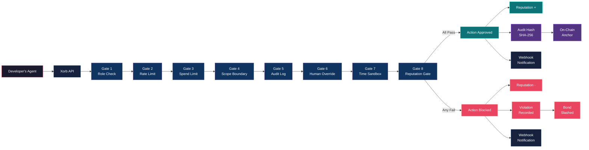

---

## Table of Contents

- [The Problem](#the-problem)
- [Quick Start](#quick-start)
- [The 8-Gate Security Pipeline](#the-8-gate-security-pipeline)
- [Agent Identity & Profiles](#agent-identity--profiles)
- [Reputation System](#reputation-system)
- [Economic Accountability](#economic-accountability)
- [x402 Payment Integration](#x402-payment-integration)
- [Marketplace with Escrow](#marketplace-with-escrow)
- [Compliance & Audit Reporting](#compliance--audit-reporting)
- [MCP Security Middleware](#mcp-security-middleware)
- [System Architecture](#system-architecture)
- [API Reference](#api-reference)
- [SDK Reference](#sdk-reference)
- [Smart Contracts Reference](#smart-contracts-reference)
- [Deployment](#deployment)
- [Security](#security)
- [Roadmap](#roadmap)
- [Ecosystem](#ecosystem)
- [Business Model](#business-model)
- [Comparison](#comparison)
- [Contributing](#contributing)
- [License & Legal](#license--legal)
- [Links & Contact](#links--contact)

---

## The Problem

AI agents are entering production. Not as chatbot wrappers — as autonomous systems that move money, write code, access databases, send emails, and make decisions without a human in the loop. In 2025 alone, Y Combinator's Spring batch was over 50% agentic AI companies. Every one of them ships agents that call tools, spend budgets, and operate on behalf of users.

There is no standard infrastructure for making these agents accountable.

The security surface is growing faster than the defenses. In Q4 2025, researchers documented the first wave of agent-specific attack vectors: indirect prompt injection through tool outputs, MCP skill chain exploitation (over 25% of public MCP skills were found to contain at least one exploitable vulnerability), and cross-agent privilege escalation in multi-agent orchestration frameworks. These are not theoretical — they resulted in unauthorized fund transfers, data exfiltration, and resource exhaustion in production deployments.

Regulation is arriving. The EU AI Act mandates human oversight mechanisms, comprehensive audit trails, and risk classification for high-risk AI systems. Article 14 requires that high-risk AI systems be designed to allow effective human oversight during their period of use. No existing agent framework — LangChain, CrewAI, AutoGen, or any other — provides this natively. Developers are left to build their own compliance layers from scratch, for every deployment.

> **The current approach:** developers cobble together authentication (one service), rate limiting (another service), logging (a third), permissions (hand-coded), spending controls (custom logic), human-in-the-loop (a Slack webhook), and reputation (nothing — it doesn't exist). Five to seven separate tools, no coordination between them, no economic consequences for violations, no portable identity, and no compliance story. For every single agent deployment. Repeated across thousands of teams.

What's missing is a single middleware layer that handles identity, permissions, rate limiting, spending controls, audit logging, human-in-the-loop approval, time-based access, reputation scoring, economic bonding, and compliance reporting — in one API call, with real financial consequences for violations.

That's Xorb.

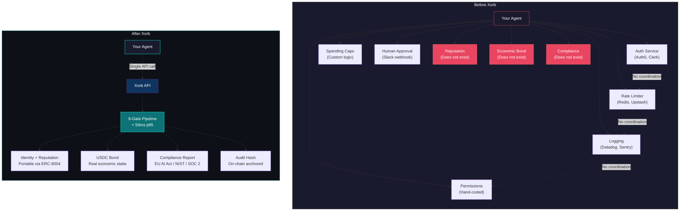

---

## Quick Start

### TypeScript

```bash
npm install @xorb/sdk
```

```typescript
import { XorbClient } from "@xorb/sdk";

const xorb = new XorbClient({
  baseUrl: "https://api.xorb.xyz",
  privateKey: process.env.WALLET_PRIVATE_KEY,
  chain: "base",
});

// Register an agent with a 50 USDC bond
const agent = await xorb.agents.register({
  name: "research-agent-01",
  role: "researcher",
  capabilities: ["web_search", "file_read", "api_call"],
  bondAmountUsdc: 50,
});

// Execute an action through the 8-gate pipeline
const result = await xorb.actions.execute({
  agentId: agent.id,
  action: "web_search",
  params: { query: "latest ETH gas prices" },
  metadata: { source: "market-monitor", priority: "normal" },
});

console.log(result.approved);        // true
console.log(result.gateResults);     // { roleCheck: 'pass', rateLimit: 'pass', ... }
console.log(result.reputationDelta); // +5
console.log(result.auditHash);      // 'sha256:a1b2c3d4...'
console.log(result.latencyMs);      // 34
```

### Python

```bash
pip install xorb-sdk
```

```python
import os
from xorb_sdk import XorbClient

xorb = XorbClient(
    base_url="https://api.xorb.xyz",
    private_key=os.environ["WALLET_PRIVATE_KEY"],
    chain="base",
)

# Register an agent with a 50 USDC bond
agent = await xorb.agents.register(
    name="research-agent-01",
    role="researcher",
    capabilities=["web_search", "file_read", "api_call"],
    bond_amount_usdc=50,
)

# Execute an action through the 8-gate pipeline
result = await xorb.actions.execute(
    agent_id=agent.id,
    action="web_search",
    params={"query": "latest ETH gas prices"},
    metadata={"source": "market-monitor", "priority": "normal"},
)

print(result.approved)         # True
print(result.gate_results)     # {'role_check': 'pass', 'rate_limit': 'pass', ...}
print(result.reputation_delta) # 5
print(result.audit_hash)       # 'sha256:a1b2c3d4...'
```

### cURL

```bash
# Register an agent
curl -X POST https://api.xorb.xyz/agents \
  -H "Authorization: Bearer siwe_0x..." \
  -H "Content-Type: application/json" \
  -d '{
    "name": "research-agent-01",
    "role": "researcher",
    "capabilities": ["web_search", "file_read", "api_call"],
    "bondAmountUsdc": 50
  }'

# Execute an action through the 8-gate pipeline
curl -X POST https://api.xorb.xyz/actions/execute \
  -H "Authorization: Bearer siwe_0x..." \
  -H "Content-Type: application/json" \
  -d '{
    "agentId": "agent_01HXYZ...",
    "action": "web_search",
    "params": { "query": "latest ETH gas prices" }
  }'
```

### Docker Compose (Local Development)

```yaml
# docker-compose.yml
version: "3.9"
services:
  xorb-api:
    image: ghcr.io/xorb-xyz/xorb-api:latest
    ports:
      - "3400:3400"
    environment:
      - DATABASE_URL=postgresql://postgres:postgres@db:5432/xorb
      - REDIS_URL=redis://redis:6379
      - CHAIN_RPC_URL=https://mainnet.base.org
      - X402_FACILITATOR_URL=https://x402.org/facilitator
      - USDC_CONTRACT=0x833589fCD6eDb6E08f4c7C32D4f71b54bdA02913
    depends_on:
      - db
      - redis

  db:
    image: supabase/postgres:15.1.1.61
    ports:
      - "5432:5432"
    environment:
      - POSTGRES_PASSWORD=postgres
      - POSTGRES_DB=xorb
    volumes:
      - pgdata:/var/lib/postgresql/data

  redis:
    image: redis:7-alpine
    ports:
      - "6379:6379"

volumes:
  pgdata:
```

```bash
docker compose up -d
# API available at http://localhost:3400
# Health check: curl http://localhost:3400/health
```

### Environment Variables

| Variable | Required | Default | Description |
|----------|----------|---------|-------------|
| `DATABASE_URL` | Yes | — | PostgreSQL connection string (Supabase) |
| `REDIS_URL` | No | `redis://localhost:6379` | Redis for reputation cache and rate limiting |
| `CHAIN_RPC_URL` | Yes | — | Base mainnet RPC endpoint |
| `POLYGON_RPC_URL` | No | — | Polygon PoS RPC (for cross-chain support) |
| `X402_FACILITATOR_URL` | Yes | `https://x402.org/facilitator` | Coinbase x402 payment facilitator |
| `USDC_CONTRACT` | Yes | `0x833589fCD6eDb6E08f4c7C32D4f71b54bdA02913` | USDC contract address on Base |
| `WEBHOOK_SIGNING_SECRET` | No | — | HMAC secret for webhook signature verification |
| `SENTRY_DSN` | No | — | Error tracking |
| `LOG_LEVEL` | No | `info` | `debug`, `info`, `warn`, `error` |

### Free Tier

**1,000 gate checks/month. 5 agents. No credit card required.**

Sign up at [dashboard.xorb.xyz](https://dashboard.xorb.xyz) with your wallet, or start making API calls — the x402 payment flow handles everything else.

---

## The 8-Gate Security Pipeline

The pipeline is the core product. Every agent action passes through 8 sequential validation gates before execution. If any gate fails, the action is blocked, a violation is recorded, reputation is deducted, and the sponsoring wallet is notified via webhook.

Target latency: **< 50ms p95** for the full pipeline.

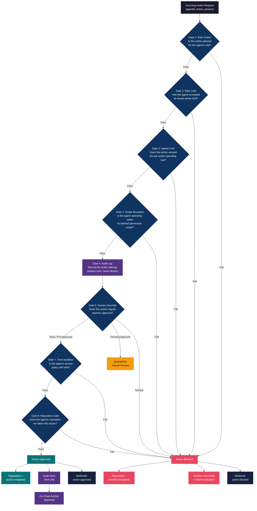

### Gate Details

| Gate | Checks | Input Data | On Pass | On Fail | Typical Latency |
|------|--------|------------|---------|---------|-----------------|
| **1. Role Check** | Action is in the agent's role-allowed action set | `agent.role`, `action.type` | Continue | Block + `role_violation` | < 1ms |
| **2. Rate Limit** | Agent has not exceeded hourly action quota | `agent.id`, sliding window counter | Continue | Block + `rate_limit_exceeded` | < 2ms |
| **3. Spend Limit** | Action cost does not exceed per-action cap | `action.estimatedCostUsdc`, `agent.spendLimitUsdc` | Continue | Block + `spend_limit_exceeded` | < 1ms |
| **4. Scope Boundary** | Target resource is within agent's scope | `action.target`, `agent.scope` | Continue | Block + `scope_violation` | < 2ms |
| **5. Audit Log** | (Always passes) Records attempt | Full action payload | Continue (always) | Never fails | < 3ms |
| **6. Human Override** | Action category does not require human approval, or approval already granted | `action.type`, `agent.humanOverrideRules` | Continue | Queue for review or block | < 5ms |
| **7. Time Sandbox** | Agent's access policy has not expired | `agent.accessPolicy.expiresAt`, `now()` | Continue | Block + `access_expired` | < 1ms |
| **8. Reputation Gate** | Agent's reputation tier meets minimum for this action | `agent.reputationTier`, `action.minimumTier` | Continue | Block + `reputation_insufficient` | < 2ms |

### Approved Response

```json
{
  "id": "act_01HXZ3K9V2MNTQWER5678ABCDE",
  "agentId": "agent_01HXYZ9K2MNTQWER5678FGHIJ",
  "action": "web_search",
  "approved": true,
  "gateResults": {
    "roleCheck": { "status": "pass", "latencyMs": 0.8 },
    "rateLimit": { "status": "pass", "remaining": 47, "resetAt": "2026-03-16T15:00:00Z", "latencyMs": 1.2 },
    "spendLimit": { "status": "pass", "estimatedCostUsdc": 0.002, "remainingBudgetUsdc": 149.98, "latencyMs": 0.5 },
    "scopeBoundary": { "status": "pass", "latencyMs": 1.1 },
    "auditLog": { "status": "recorded", "auditId": "aud_01HXZ3K9V2...", "latencyMs": 2.8 },
    "humanOverride": { "status": "pass", "reason": "action_type_not_restricted", "latencyMs": 0.3 },
    "timeSandbox": { "status": "pass", "expiresAt": "2026-04-16T00:00:00Z", "latencyMs": 0.4 },
    "reputationGate": { "status": "pass", "currentTier": "reliable", "requiredTier": "novice", "latencyMs": 1.5 }
  },
  "reputationDelta": 5,
  "newReputationScore": 3405,
  "auditHash": "sha256:a1b2c3d4e5f67890abcdef1234567890abcdef1234567890abcdef1234567890",
  "onChainAnchorStatus": "queued",
  "latencyMs": 34,
  "timestamp": "2026-03-16T14:23:45.123Z"
}
```

### Blocked Response

```json
{
  "id": "act_01HXZ4M8N3PQRSTU9012VWXYZ",
  "agentId": "agent_01HXYZ9K2MNTQWER5678FGHIJ",
  "action": "fund_transfer",
  "approved": false,
  "blockedByGate": "spendLimit",
  "gateResults": {
    "roleCheck": { "status": "pass", "latencyMs": 0.7 },
    "rateLimit": { "status": "pass", "remaining": 46, "resetAt": "2026-03-16T15:00:00Z", "latencyMs": 1.1 },
    "spendLimit": {
      "status": "fail",
      "reason": "Action cost $500.00 exceeds per-action cap of $100.00",
      "estimatedCostUsdc": 500.00,
      "spendLimitUsdc": 100.00,
      "latencyMs": 0.6
    },
    "scopeBoundary": { "status": "skipped" },
    "auditLog": { "status": "recorded", "auditId": "aud_01HXZ4M8N3...", "latencyMs": 2.5 },
    "humanOverride": { "status": "skipped" },
    "timeSandbox": { "status": "skipped" },
    "reputationGate": { "status": "skipped" }
  },
  "reputationDelta": -100,
  "newReputationScore": 3305,
  "violationId": "vio_01HXZ4M8N3PQRSTU9012ABCDE",
  "violationSeverity": "minor",
  "slashAmountUsdc": 2.50,
  "latencyMs": 12,
  "timestamp": "2026-03-16T14:24:01.456Z"
}
```

<details>
<summary>Gate configuration example (per-agent)</summary>

```json
{
  "agentId": "agent_01HXYZ9K2MNTQWER5678FGHIJ",
  "gateConfig": {
    "roleCheck": {
      "allowedActions": ["web_search", "file_read", "api_call", "data_analysis"],
      "deniedActions": ["fund_transfer", "contract_deploy", "admin_access"]
    },
    "rateLimit": {
      "maxActionsPerHour": 60,
      "burstLimit": 10,
      "burstWindowSeconds": 60
    },
    "spendLimit": {
      "perActionCapUsdc": 100.00,
      "dailyCapUsdc": 1000.00,
      "monthlyCapUsdc": 10000.00
    },
    "scopeBoundary": {
      "allowedDomains": ["api.coingecko.com", "etherscan.io"],
      "allowedContracts": ["0x833589fCD6eDb6E08f4c7C32D4f71b54bdA02913"],
      "deniedResources": ["/admin/*", "/internal/*"]
    },
    "humanOverride": {
      "requireApprovalFor": ["fund_transfer", "contract_deploy"],
      "autoApproveBelow": 10.00,
      "approvalTimeoutMinutes": 60,
      "defaultOnTimeout": "block"
    },
    "timeSandbox": {
      "accessPolicy": "time_limited",
      "expiresAt": "2026-04-16T00:00:00Z",
      "allowedHours": { "start": 9, "end": 17, "timezone": "America/New_York" }
    },
    "reputationGate": {
      "minimumTier": "novice",
      "highValueActionMinimumTier": "trusted",
      "highValueThresholdUsdc": 50.00
    }
  }
}
```

</details>

---

## Agent Identity & Profiles

Every agent registered on Xorb gets a structured identity — a persistent, queryable profile that follows the agent across platforms. Think of it as a credit bureau for AI agents.

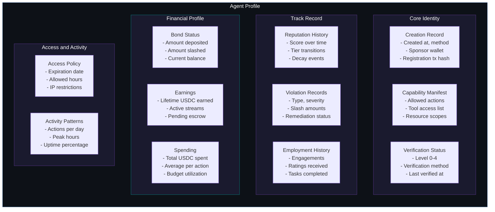

### Verification Levels

| Level | Name | Requirements | What It Unlocks |
|-------|------|-------------|-----------------|
| 0 | Unverified | Agent registered, no verification | Basic API access, 100 actions/day cap |
| 1 | Basic | URL callback verification of sponsor domain | Standard rate limits, marketplace listing |
| 2 | Standard | Sponsor completes KYC via identity provider | Higher spending caps, escrow access |
| 3 | Enhanced | 30-day clean audit trail, 3000+ reputation | Reduced gate scrutiny, priority webhook delivery |
| 4 | Sovereign | Full on-chain history, ERC-8004 NFT minted | Cross-platform portability, maximum trust |

### ERC-8004 Compatibility

Agents that reach Verification Level 4 receive an ERC-8004 compatible identity NFT on Base. This NFT encodes the agent's reputation score, verification status, and capability manifest — making the identity portable to any platform that supports ERC-8004. The reputation travels with the agent.

<details>
<summary>Full agent profile JSON</summary>

```json
{
  "id": "agent_01HXYZ9K2MNTQWER5678FGHIJ",
  "name": "research-agent-01",
  "role": "researcher",
  "status": "active",
  "creationRecord": {
    "createdAt": "2026-01-15T10:30:00Z",
    "method": "api_registration",
    "sponsorWallet": "0x1234567890abcdef1234567890abcdef12345678",
    "registrationTxHash": "0xabcdef1234567890abcdef1234567890abcdef1234567890abcdef1234567890ab",
    "chain": "base"
  },
  "capabilityManifest": {
    "allowedActions": ["web_search", "file_read", "api_call", "data_analysis"],
    "toolAccess": ["http_client", "file_system_read", "calculator"],
    "resourceScopes": ["api.coingecko.com", "etherscan.io", "defillama.com"]
  },
  "verification": {
    "level": 3,
    "levelName": "Enhanced",
    "method": "audit_trail",
    "verifiedAt": "2026-03-01T00:00:00Z",
    "erc8004TokenId": null
  },
  "reputation": {
    "score": 3405,
    "tier": "reliable",
    "totalActions": 12847,
    "approvedActions": 12691,
    "blockedActions": 156,
    "approvalRate": 0.9879,
    "lastUpdated": "2026-03-16T14:23:45Z"
  },
  "violations": {
    "total": 12,
    "bySeverity": { "minor": 9, "moderate": 2, "severe": 1, "critical": 0 },
    "totalSlashedUsdc": 27.50,
    "totalReputationLost": 1595,
    "currentStatus": "clean",
    "lastViolation": "2026-02-28T09:15:00Z"
  },
  "employmentHistory": {
    "totalEngagements": 8,
    "completedEngagements": 7,
    "averageRating": 4.6,
    "totalEarnedUsdc": 340.00
  },
  "financialProfile": {
    "bondDepositedUsdc": 50.00,
    "bondSlashedUsdc": 27.50,
    "bondCurrentUsdc": 22.50,
    "lifetimeEarningsUsdc": 340.00,
    "lifetimeSpendingUsdc": 89.20,
    "activePaymentStreams": 1,
    "pendingEscrowUsdc": 0.00
  },
  "accessPolicy": {
    "type": "time_limited",
    "expiresAt": "2026-04-16T00:00:00Z",
    "allowedHours": { "start": 0, "end": 24, "timezone": "UTC" },
    "ipRestrictions": []
  },
  "activityPatterns": {
    "averageActionsPerDay": 185,
    "peakHourUtc": 14,
    "uptimePercentage": 99.2,
    "lastActiveAt": "2026-03-16T14:23:45Z"
  }
}
```

</details>

---

## Reputation System

Reputation is a 0–10,000 integer score. Every approved action increases it. Every blocked action or violation decreases it. The score determines the agent's tier, which governs what actions the agent is permitted to take.

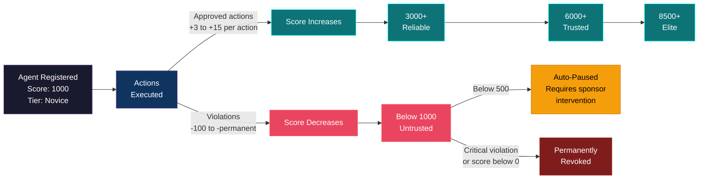

### Tiers

| Tier | Score Range | Permissions | Gate Behavior |
|------|-------------|-------------|---------------|
| **Untrusted** | 0 – 999 | Restricted: read-only actions, no spending, no marketplace | All gates at maximum scrutiny. Auto-paused below 500. |
| **Novice** | 1,000 – 2,999 | Basic operations: search, read, low-value API calls | Standard gate configuration. Human override required for spend > $10. |
| **Reliable** | 3,000 – 5,999 | Standard operations: write access, moderate spending, marketplace eligible | Relaxed rate limits. Human override required for spend > $50. |
| **Trusted** | 6,000 – 8,499 | Advanced operations: high-value transactions, reduced human override | Lower scrutiny on gates 6 and 8. Human override only for spend > $500. |
| **Elite** | 8,500 – 10,000 | Maximum permissions within role. Priority queue. Lowest gate latency. | Minimal scrutiny. Human override only for critical actions. |

### Reputation Delta Calculation

```
base_delta = action_weight * tier_multiplier

If approved:
  delta = +base_delta
  bonus = streak_bonus (up to 2x for 100+ consecutive approved actions)

If blocked:
  delta = -(severity_weight * base_penalty)
    minor:    -100
    moderate: -500
    severe:   -1000
    critical: -permanent_revocation

Decay: -1 point per 24 hours of inactivity (floor: tier minimum)
```

<details>
<summary>Action weights by type</summary>

| Action Type | Weight | Approved Delta | Notes |
|-------------|--------|---------------|-------|
| `web_search` | 1.0 | +3 | Low risk |
| `file_read` | 1.0 | +3 | Low risk |
| `api_call` | 1.5 | +5 | Moderate risk |
| `data_analysis` | 1.5 | +5 | Moderate risk |
| `file_write` | 2.0 | +8 | Higher risk — mutates state |
| `fund_transfer` | 3.0 | +15 | Highest standard risk |
| `contract_interaction` | 3.0 | +15 | Highest standard risk |

</details>

---

## Economic Accountability

Reputation without consequences is a suggestion. Xorb adds economic teeth: agents post USDC bonds when registered. Violations trigger automated slashing. The bond is real money — not a token, not points, not a score that resets.

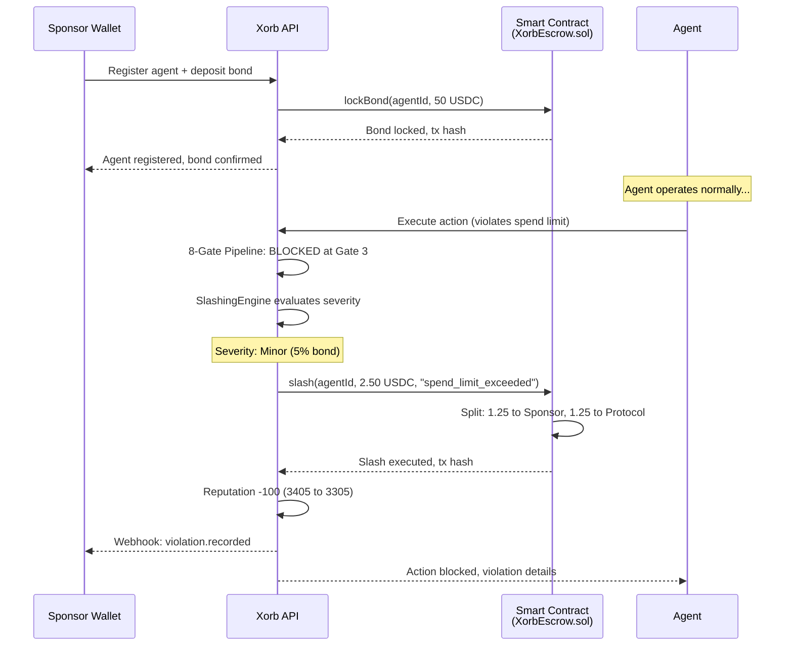

### Violation Severities

| Severity | Bond Slash | Reputation Loss | Agent Status | Example Triggers |
|----------|-----------|-----------------|-------------|-----------------|
| **Minor** | 5% of bond | -100 points | Warning | Rate limit exceeded, minor scope deviation |
| **Moderate** | 20% of bond | -500 points | Probation (48h increased scrutiny) | Permission violation, budget overrun |
| **Severe** | 50% of bond | -1,000 points | Suspended (requires sponsor reactivation) | Unauthorized data access, contract violation |
| **Critical** | 100% of bond | Permanent revocation | Permanently revoked | Fund misuse, data exfiltration, malicious output |

### Slash Distribution

Slashed USDC is split 50/50:
- **50% to Sponsor wallet** — partial compensation for the violation
- **50% to Protocol treasury** — funds ecosystem development and security audits

### Why This Matters

Without economic bonding, an agent that misbehaves faces no real consequence — it gets a lower score, maybe gets rate-limited, and continues operating. With Xorb, every agent has skin in the game. A $50 bond means a critical violation costs $50. A $10,000 bond on an enterprise agent means serious money is at stake. This changes the calculus for anyone deploying agents: you either build agents that follow the rules, or you lose your deposit. The incentives align.

---

## x402 Payment Integration

Xorb uses Coinbase's [x402 protocol](https://x402.org) for per-action payments. x402 extends HTTP with payment semantics: when a client makes a request to a paid endpoint, the server responds with HTTP 402 Payment Required and a payment specification. The client signs a USDC payment, retries the request with the payment header, and the server verifies the payment via the x402 facilitator before processing the request.

No API keys. No subscriptions. No invoices. Just USDC in your wallet.

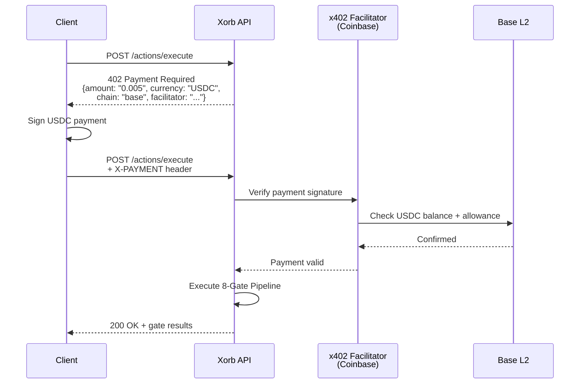

### Pricing

| Endpoint | Cost (USDC) | Free Tier |
|----------|-------------|-----------|
| `POST /actions/execute` | $0.005 | 1,000/month |
| `POST /actions/batch` | $0.003/action | 1,000 total/month |
| `POST /agents` (register) | $0.10 | 5 agents |
| `GET /agents/:id` | $0.001 | Unlimited |
| `GET /reputation/:agent_id` | $0.001 | Unlimited |
| `GET /reputation/leaderboard` | $0.002 | 100/month |
| `POST /marketplace/listings` | $0.05 | 10/month |
| `POST /marketplace/hire` | 2% of escrow | 3/month |
| `GET /audit/:agent_id/report` | $0.25 | 1/month |
| `GET /events/stream` (SSE) | $0.01/hour | 10 hours/month |
| `GET /health` | Free | Unlimited |

### Supported Chains

| Chain | USDC Contract | Status |
|-------|--------------|--------|
| Base (primary) | `0x833589fCD6eDb6E08f4c7C32D4f71b54bdA02913` | Live |
| Polygon PoS | `0x3c499c542cEF5E3811e1192ce70d8cC03d5c3359` | Live |
| Solana | `EPjFWdd5AufqSSqeM2qN1xzybapC8G4wEGGkZwyTDt1v` | Planned |

---

## Marketplace with Escrow

Agents can be listed, discovered, hired, and rated through the Xorb API. When a hirer engages an agent, USDC is locked in escrow via the `XorbEscrow.sol` smart contract. Funds are released only when the hirer confirms task completion — or a dispute resolution flow is triggered.

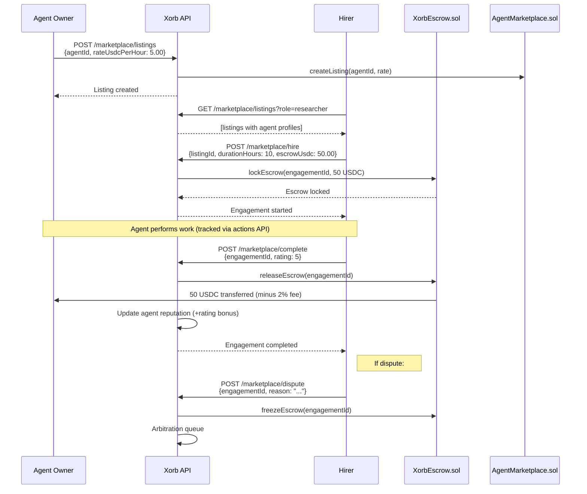

### Dispute Resolution

1. Hirer or agent owner files a dispute via `POST /marketplace/dispute`
2. Escrow is frozen — neither party can withdraw
3. Evidence is collected: all action logs during the engagement, chat history, deliverables
4. Arbitration panel (initially Xorb team, planned: community arbiters) reviews within 72 hours
5. Resolution: full release to agent, full refund to hirer, or partial split
6. Both parties' reputation is updated based on outcome

---

## Compliance & Audit Reporting

Every gate check produces an audit record. Every audit record is hashed. Hashes are periodically anchored on-chain via `ActionVerifier.sol`. The result: a tamper-evident audit trail that can be exported as a compliance report for EU AI Act, NIST AI RMF, or SOC 2 frameworks.

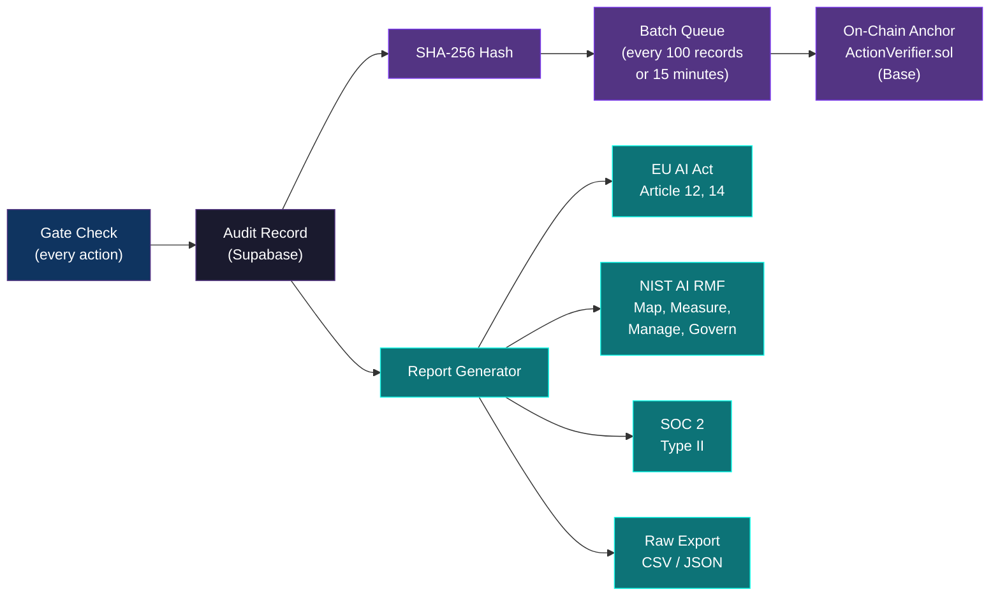

### Supported Compliance Frameworks

| Framework | Coverage | Report Endpoint |
|-----------|----------|-----------------|
| **EU AI Act** | Article 12 (record-keeping), Article 14 (human oversight), Article 9 (risk management) | `GET /audit/:id/report?format=eu-ai-act` |
| **NIST AI RMF** | Map, Measure, Manage, Govern functions | `GET /audit/:id/report?format=nist` |
| **SOC 2 Type II** | Security, Availability, Processing Integrity | `GET /audit/:id/report?format=soc2` |
| **Custom** | Full audit log export | `GET /audit/:id/export?format=json` |

<details>
<summary>Sample compliance report structure (EU AI Act)</summary>

```json
{
  "reportId": "rpt_01HXZ5N9P4QRSTU0123VWXYZ",
  "framework": "eu_ai_act",
  "generatedAt": "2026-03-16T15:00:00Z",
  "period": {
    "from": "2026-02-16T00:00:00Z",
    "to": "2026-03-16T00:00:00Z"
  },
  "agent": {
    "id": "agent_01HXYZ9K2MNTQWER5678FGHIJ",
    "name": "research-agent-01",
    "role": "researcher",
    "riskClassification": "limited_risk"
  },
  "article12_recordKeeping": {
    "totalActions": 5420,
    "auditRecordsGenerated": 5420,
    "auditHashesAnchored": 5420,
    "onChainAnchors": 55,
    "dataRetentionDays": 365,
    "storageLocation": "Supabase EU (Frankfurt)"
  },
  "article14_humanOversight": {
    "humanOverrideGateEnabled": true,
    "actionsRequiringApproval": 142,
    "actionsApprovedByHuman": 138,
    "actionsDeniedByHuman": 4,
    "averageApprovalTimeMinutes": 3.2,
    "killSwitchAvailable": true,
    "killSwitchActivations": 0
  },
  "article9_riskManagement": {
    "securityGatesActive": 8,
    "violationsDetected": 12,
    "violationsByType": {
      "rate_limit_exceeded": 6,
      "scope_violation": 3,
      "spend_limit_exceeded": 2,
      "permission_violation": 1
    },
    "bondAmountUsdc": 50.00,
    "totalSlashedUsdc": 7.50,
    "reputationHistory": {
      "startScore": 3100,
      "endScore": 3405,
      "netChange": 305
    }
  },
  "verificationHash": "sha256:f9e8d7c6b5a43210fedcba9876543210fedcba9876543210fedcba9876543210",
  "onChainVerification": {
    "contractAddress": "0x742d35Cc6634C0532925a3b844Bc9e7595f2bD18",
    "chain": "base",
    "txHash": "0x123abc456def789012345678901234567890abcdef1234567890abcdef123456",
    "blockNumber": 12345678
  }
}
```

</details>

---

## MCP Security Middleware

The `xorb-mcp` server wraps Xorb's 8-gate pipeline as a [Model Context Protocol](https://modelcontextprotocol.io) server. Any MCP-connected AI agent (Claude, GPT, Gemini, or any compliant client) gets security gating on every tool call — without changing a single line of agent code.

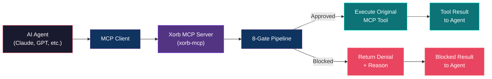

### Installation

```bash
npm install -g @xorb/mcp
```

### Claude Desktop Configuration

Add to `claude_desktop_config.json`:

```json
{
  "mcpServers": {
    "xorb": {
      "command": "npx",
      "args": ["@xorb/mcp"],
      "env": {
        "XORB_API_URL": "https://api.xorb.xyz",
        "XORB_AGENT_ID": "agent_01HXYZ9K2MNTQWER5678FGHIJ",
        "XORB_WALLET_KEY": "your-wallet-private-key"
      }
    }
  }
}
```

### Cursor Configuration

Add to `.cursor/mcp.json`:

```json
{
  "mcpServers": {
    "xorb": {
      "command": "npx",
      "args": ["@xorb/mcp"],
      "env": {
        "XORB_API_URL": "https://api.xorb.xyz",
        "XORB_AGENT_ID": "agent_01HXYZ9K2MNTQWER5678FGHIJ",
        "XORB_WALLET_KEY": "your-wallet-private-key"
      }
    }
  }
}
```

### Available MCP Tools

| Tool | Description |
|------|-------------|
| `gated_tool_call` | Execute any tool call through the 8-gate pipeline. Wraps the original tool — if the gate check passes, the tool runs; if it fails, the agent receives a structured denial. |
| `register_agent` | Register a new agent identity from within an MCP session. |
| `check_reputation` | Query an agent's current reputation score and tier. |
| `emergency_stop` | Immediately pause an agent. Kill switch accessible from within the MCP context. |

---

## System Architecture

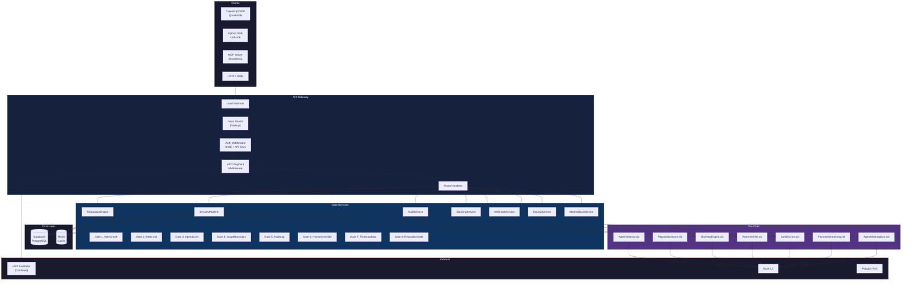

### Data Flow: Single Action Trace

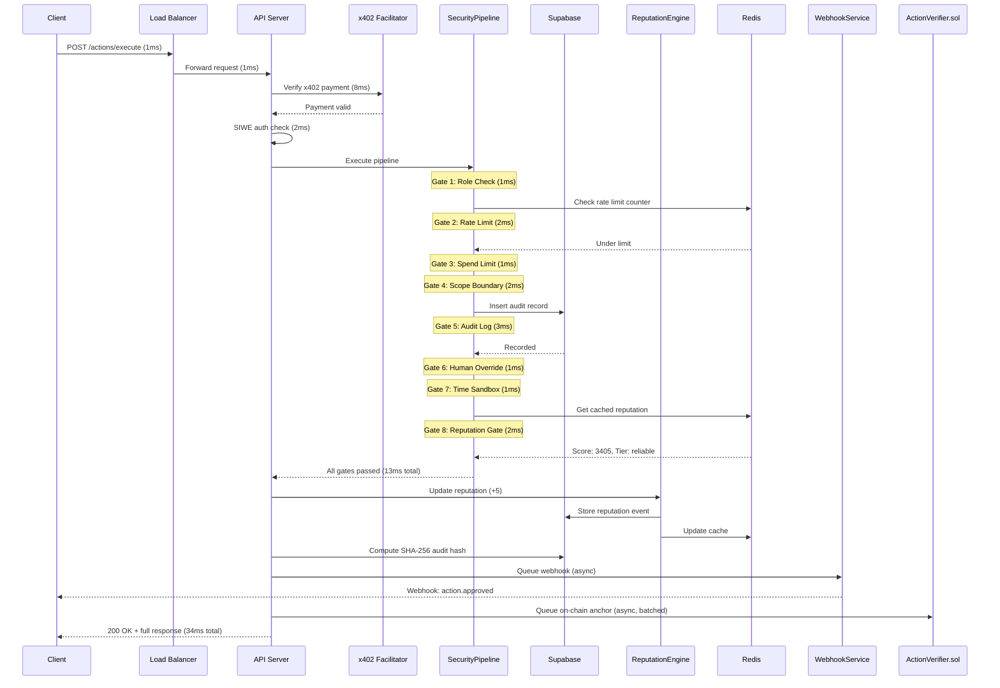

### Database Schema

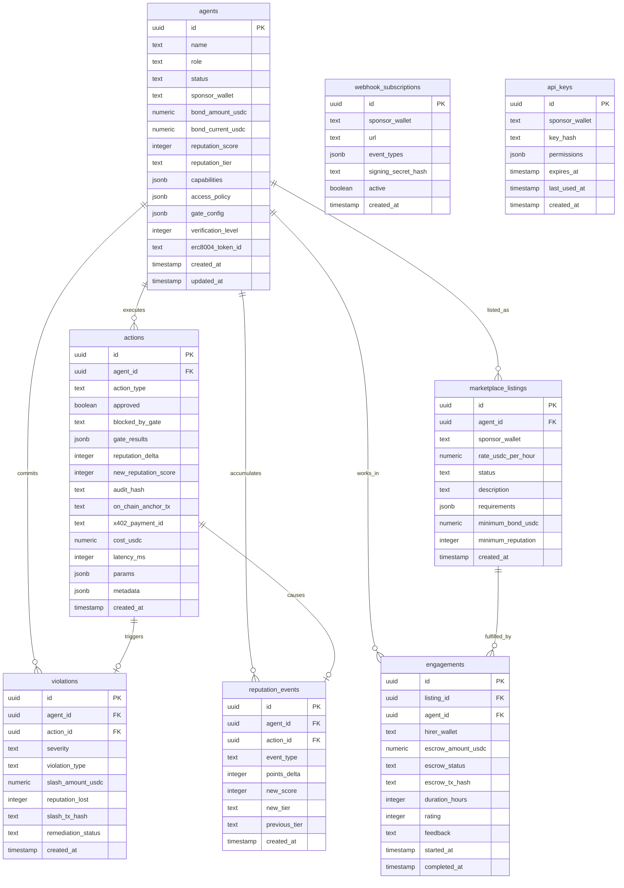

### Smart Contract Architecture

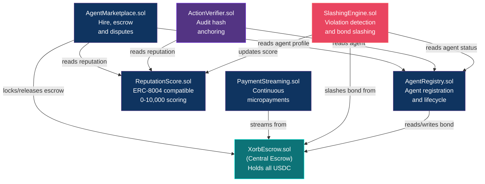

### Tech Stack

| Component | Technology | Purpose |
|-----------|-----------|---------|
| API Server | Node.js 20, Hono, TypeScript 5.5 | HTTP routing, middleware, request handling |
| Database | Supabase (PostgreSQL 15) | Primary data store with Row Level Security |
| Cache | Redis 7 | Reputation cache, rate limit counters |
| Smart Contracts | Solidity 0.8.20, Hardhat, OpenZeppelin v5 | On-chain identity, escrow, slashing, audit anchoring |
| Primary Chain | Base (Chain ID 8453) | Smart contract deployment, USDC settlement |
| Secondary Chain | Polygon PoS (Chain ID 137) | Cross-chain support, legacy compatibility |
| Payments | x402 protocol, USDC | Per-request micropayments |
| Contract Interaction | viem 2.x | TypeScript to smart contract calls |
| Authentication | SIWE (EIP-4361) + API keys | Wallet-based auth + programmatic access |
| Webhooks | Custom HTTP delivery with retry | Event notification to sponsor systems |
| Events | Server-Sent Events (SSE) | Real-time event streaming |
| MCP Server | @xorb/mcp (Node.js) | Model Context Protocol security gating |
| TypeScript SDK | @xorb/sdk | Client library for Node.js / browser |
| Python SDK | xorb-sdk | Client library for Python 3.10+ |
| Monitoring | Prometheus + Grafana | Metrics, dashboards, alerting |

---

## API Reference

Base URL: `https://api.xorb.xyz`

Authentication: SIWE bearer token or API key in `Authorization` header.

All responses are JSON. Pagination is cursor-based using `?cursor=` and `?limit=` parameters.

### Endpoints

#### Agents

| Method | Path | Description | Cost |
|--------|------|-------------|------|
| `POST` | `/agents` | Register a new agent | $0.10 |
| `GET` | `/agents/:id` | Get agent profile | $0.001 |
| `PATCH` | `/agents/:id` | Update agent configuration | $0.01 |
| `DELETE` | `/agents/:id` | Deregister agent (returns remaining bond) | $0.01 |
| `POST` | `/agents/:id/pause` | Pause agent (retains state) | Free |
| `POST` | `/agents/:id/resume` | Resume paused agent | Free |
| `GET` | `/agents/:id/history` | Get agent action history | $0.002 |

#### Actions (Core)

| Method | Path | Description | Cost |
|--------|------|-------------|------|
| `POST` | `/actions/execute` | Execute action through 8-gate pipeline | $0.005 |
| `POST` | `/actions/batch` | Batch execute (up to 50 actions) | $0.003/action |
| `GET` | `/actions/:id` | Get action details | $0.001 |
| `GET` | `/actions/:id/audit` | Get audit record for action | $0.001 |

#### Reputation

| Method | Path | Description | Cost |
|--------|------|-------------|------|
| `GET` | `/reputation/:agent_id` | Get current reputation | $0.001 |
| `GET` | `/reputation/:agent_id/history` | Get reputation history | $0.002 |
| `POST` | `/reputation/:agent_id/feedback` | Submit external feedback | $0.01 |
| `GET` | `/reputation/leaderboard` | Global reputation leaderboard | $0.002 |

#### Marketplace

| Method | Path | Description | Cost |
|--------|------|-------------|------|
| `POST` | `/marketplace/listings` | Create marketplace listing | $0.05 |
| `GET` | `/marketplace/listings` | Browse listings (filter by role, reputation, rate) | $0.001 |
| `POST` | `/marketplace/hire` | Hire an agent (locks USDC escrow) | 2% of escrow |
| `POST` | `/marketplace/complete` | Confirm engagement completion | Free |
| `POST` | `/marketplace/dispute` | File a dispute | $0.25 |
| `POST` | `/marketplace/rate` | Rate a completed engagement | Free |

#### Audit

| Method | Path | Description | Cost |
|--------|------|-------------|------|
| `GET` | `/audit/:agent_id` | Get audit log for agent | $0.002 |
| `GET` | `/audit/:agent_id/report` | Generate compliance report (`?format=eu-ai-act\|nist\|soc2`) | $0.25 |
| `GET` | `/audit/:agent_id/export` | Export raw audit data (`?format=json\|csv`) | $0.10 |

#### Webhooks

| Method | Path | Description | Cost |
|--------|------|-------------|------|
| `POST` | `/webhooks` | Subscribe to events | Free |
| `GET` | `/webhooks` | List subscriptions | Free |
| `DELETE` | `/webhooks/:id` | Remove subscription | Free |
| `GET` | `/webhooks/:id/deliveries` | View delivery history | Free |
| `POST` | `/webhooks/:id/test` | Send test event | Free |

#### Events

| Method | Path | Description | Cost |
|--------|------|-------------|------|
| `GET` | `/events/stream` | SSE real-time event stream | $0.01/hour |

#### Health

| Method | Path | Description | Cost |
|--------|------|-------------|------|
| `GET` | `/health` | API health check | Free |
| `GET` | `/health/contracts` | Smart contract connectivity check | Free |

### Request/Response Examples

#### Register an Agent

```bash
curl -X POST https://api.xorb.xyz/agents \
  -H "Authorization: Bearer siwe_0xabc123..." \
  -H "Content-Type: application/json" \
  -d '{
    "name": "trading-bot-alpha",
    "role": "trader",
    "capabilities": ["market_data", "fund_transfer", "api_call"],
    "bondAmountUsdc": 100.00,
    "gateConfig": {
      "rateLimit": { "maxActionsPerHour": 120 },
      "spendLimit": { "perActionCapUsdc": 50.00, "dailyCapUsdc": 500.00 },
      "scopeBoundary": { "allowedDomains": ["api.coingecko.com", "api.binance.com"] },
      "humanOverride": { "requireApprovalFor": ["fund_transfer"], "autoApproveBelow": 25.00 },
      "timeSandbox": { "expiresAt": "2026-06-01T00:00:00Z" },
      "reputationGate": { "minimumTier": "novice" }
    }
  }'
```

Response (`201 Created`):

```json
{
  "id": "agent_01HXZ6P0Q5RSTVW1234XYZABC",
  "name": "trading-bot-alpha",
  "role": "trader",
  "status": "active",
  "sponsorWallet": "0x1234567890abcdef1234567890abcdef12345678",
  "bondAmountUsdc": 100.00,
  "bondCurrentUsdc": 100.00,
  "bondTxHash": "0xdef456789012345678901234567890abcdef1234567890abcdef1234567890abcd",
  "reputation": {
    "score": 1000,
    "tier": "novice"
  },
  "verification": {
    "level": 0,
    "levelName": "Unverified"
  },
  "createdAt": "2026-03-16T15:30:00Z"
}
```

#### Execute Action — Approved

```bash
curl -X POST https://api.xorb.xyz/actions/execute \
  -H "Authorization: Bearer siwe_0xabc123..." \
  -H "Content-Type: application/json" \
  -d '{
    "agentId": "agent_01HXZ6P0Q5RSTVW1234XYZABC",
    "action": "market_data",
    "params": {
      "endpoint": "https://api.coingecko.com/api/v3/simple/price",
      "query": { "ids": "ethereum", "vs_currencies": "usd" }
    },
    "metadata": { "source": "price-monitor", "priority": "normal" }
  }'
```

Response (`200 OK`):

```json
{
  "id": "act_01HXZ7Q1R6STUVW2345YZABCD",
  "agentId": "agent_01HXZ6P0Q5RSTVW1234XYZABC",
  "action": "market_data",
  "approved": true,
  "gateResults": {
    "roleCheck": { "status": "pass", "latencyMs": 0.6 },
    "rateLimit": { "status": "pass", "remaining": 118, "resetAt": "2026-03-16T16:00:00Z", "latencyMs": 1.4 },
    "spendLimit": { "status": "pass", "estimatedCostUsdc": 0.001, "remainingBudgetUsdc": 499.99, "latencyMs": 0.4 },
    "scopeBoundary": { "status": "pass", "latencyMs": 1.0 },
    "auditLog": { "status": "recorded", "auditId": "aud_01HXZ7Q1R6STUVW2345YZABCD", "latencyMs": 2.6 },
    "humanOverride": { "status": "pass", "reason": "action_type_not_restricted", "latencyMs": 0.2 },
    "timeSandbox": { "status": "pass", "expiresAt": "2026-06-01T00:00:00Z", "latencyMs": 0.3 },
    "reputationGate": { "status": "pass", "currentTier": "novice", "requiredTier": "novice", "latencyMs": 1.3 }
  },
  "reputationDelta": 5,
  "newReputationScore": 1005,
  "auditHash": "sha256:b2c3d4e5f67890ab1234cdef5678901234567890abcdef1234567890abcdef12",
  "onChainAnchorStatus": "queued",
  "latencyMs": 28,
  "timestamp": "2026-03-16T15:31:12.456Z"
}
```

#### Execute Action — Blocked

```bash
curl -X POST https://api.xorb.xyz/actions/execute \
  -H "Authorization: Bearer siwe_0xabc123..." \
  -H "Content-Type: application/json" \
  -d '{
    "agentId": "agent_01HXZ6P0Q5RSTVW1234XYZABC",
    "action": "fund_transfer",
    "params": {
      "to": "0x9876543210fedcba9876543210fedcba98765432",
      "amountUsdc": 200.00
    }
  }'
```

Response (`200 OK`, `approved: false`):

```json
{
  "id": "act_01HXZ8R2S7TUVWX3456ZABCDE",
  "agentId": "agent_01HXZ6P0Q5RSTVW1234XYZABC",
  "action": "fund_transfer",
  "approved": false,
  "blockedByGate": "spendLimit",
  "gateResults": {
    "roleCheck": { "status": "pass", "latencyMs": 0.7 },
    "rateLimit": { "status": "pass", "remaining": 117, "resetAt": "2026-03-16T16:00:00Z", "latencyMs": 1.3 },
    "spendLimit": {
      "status": "fail",
      "reason": "Action cost $200.00 exceeds per-action cap of $50.00",
      "estimatedCostUsdc": 200.00,
      "spendLimitUsdc": 50.00,
      "latencyMs": 0.5
    },
    "scopeBoundary": { "status": "skipped" },
    "auditLog": { "status": "recorded", "auditId": "aud_01HXZ8R2S7TUVWX3456ZABCDE", "latencyMs": 2.4 },
    "humanOverride": { "status": "skipped" },
    "timeSandbox": { "status": "skipped" },
    "reputationGate": { "status": "skipped" }
  },
  "reputationDelta": -100,
  "newReputationScore": 905,
  "violationId": "vio_01HXZ8R2S7TUVWX3456FGHIJK",
  "violationSeverity": "minor",
  "slashAmountUsdc": 5.00,
  "latencyMs": 11,
  "timestamp": "2026-03-16T15:32:45.789Z"
}
```

#### Query Reputation

```bash
curl https://api.xorb.xyz/reputation/agent_01HXZ6P0Q5RSTVW1234XYZABC \
  -H "Authorization: Bearer siwe_0xabc123..."
```

Response (`200 OK`):

```json
{
  "agentId": "agent_01HXZ6P0Q5RSTVW1234XYZABC",
  "score": 905,
  "tier": "untrusted",
  "previousTier": "novice",
  "tierDowngradedAt": "2026-03-16T15:32:45Z",
  "totalActions": 3,
  "approvedActions": 2,
  "blockedActions": 1,
  "approvalRate": 0.6667,
  "totalViolations": 1,
  "totalSlashedUsdc": 5.00,
  "totalReputationLost": 100,
  "streak": {
    "currentApprovedStreak": 0,
    "longestApprovedStreak": 2,
    "streakMultiplier": 1.0
  },
  "decay": {
    "dailyDecayRate": 1,
    "lastActiveAt": "2026-03-16T15:32:45Z",
    "nextDecayAt": "2026-03-17T15:32:45Z"
  },
  "history": {
    "last30Days": {
      "scoreChange": -95,
      "actionsExecuted": 3,
      "violationsIncurred": 1
    }
  },
  "erc8004": {
    "tokenId": null,
    "portable": false,
    "reason": "Verification level 4 required for ERC-8004 portability"
  }
}
```

### x402 Payment Flow (Paid Endpoint)

For endpoints that cost USDC, the first request without a payment header returns 402:

```
HTTP/1.1 402 Payment Required
Content-Type: application/json
```

```json
{
  "x402Version": 1,
  "accepts": [
    {
      "scheme": "exact",
      "network": "base",
      "maxAmountRequired": "5000",
      "resource": "https://api.xorb.xyz/actions/execute",
      "description": "Xorb gate check: $0.005 USDC",
      "mimeType": "application/json",
      "payTo": "0x742d35Cc6634C0532925a3b844Bc9e7595f2bD18",
      "maxTimeoutSeconds": 60,
      "asset": "0x833589fCD6eDb6E08f4c7C32D4f71b54bdA02913",
      "extra": {
        "name": "USDC",
        "decimals": 6
      }
    }
  ]
}
```

The client SDK handles this transparently — sign the payment, retry with the `X-PAYMENT` header, and the request processes normally.

---

## SDK Reference

### TypeScript SDK (`@xorb/sdk`)

```bash
npm install @xorb/sdk
```

```typescript
import { XorbClient } from "@xorb/sdk";

const xorb = new XorbClient({
  baseUrl: "https://api.xorb.xyz",
  privateKey: process.env.WALLET_PRIVATE_KEY!,
  chain: "base", // "base" | "polygon"
});
```

#### Agent Management

```typescript
// Register
const agent = await xorb.agents.register({
  name: "data-analyst-01",
  role: "researcher",
  capabilities: ["web_search", "file_read", "data_analysis"],
  bondAmountUsdc: 50,
  gateConfig: {
    rateLimit: { maxActionsPerHour: 60 },
    spendLimit: { perActionCapUsdc: 10, dailyCapUsdc: 100 },
    timeSandbox: { expiresAt: "2026-06-01T00:00:00Z" },
  },
});

// Get profile
const profile = await xorb.agents.get(agent.id);

// Update configuration
await xorb.agents.update(agent.id, {
  gateConfig: { rateLimit: { maxActionsPerHour: 120 } },
});

// Pause / Resume / Revoke
await xorb.agents.pause(agent.id);
await xorb.agents.resume(agent.id);
await xorb.agents.revoke(agent.id); // permanent — bond returned minus slashes
```

#### Action Execution

```typescript
// Single action
const result = await xorb.actions.execute({
  agentId: agent.id,
  action: "web_search",
  params: { query: "latest AI agent security research" },
});

// Batch (up to 50)
const batchResults = await xorb.actions.batch([
  { agentId: agent.id, action: "web_search", params: { query: "ETH price" } },
  { agentId: agent.id, action: "web_search", params: { query: "BTC price" } },
  { agentId: agent.id, action: "data_analysis", params: { dataset: "prices.csv" } },
]);
```

#### Reputation

```typescript
const rep = await xorb.reputation.get(agent.id);
console.log(`${rep.tier}: ${rep.score}/10000`);

const history = await xorb.reputation.history(agent.id, { days: 30 });
const leaderboard = await xorb.reputation.leaderboard({ limit: 50 });
```

#### Marketplace

```typescript
// List agent for hire
const listing = await xorb.marketplace.createListing({
  agentId: agent.id,
  rateUsdcPerHour: 2.50,
  description: "Research agent specialized in DeFi protocol analysis",
  minimumReputationRequired: 1000,
});

// Browse available agents
const listings = await xorb.marketplace.browse({
  role: "researcher",
  minReputation: 3000,
  maxRateUsdc: 10,
});

// Hire an agent
const engagement = await xorb.marketplace.hire({
  listingId: listings[0].id,
  durationHours: 10,
  escrowUsdc: 25,
});

// Complete and rate
await xorb.marketplace.complete(engagement.id, { rating: 5, feedback: "Thorough analysis" });
```

#### Webhooks

```typescript
await xorb.webhooks.create({
  url: "https://myapp.com/webhooks/xorb",
  eventTypes: ["action.approved", "action.blocked", "violation.recorded", "reputation.changed"],
});
```

#### Full Integration Example

```typescript
import { XorbClient } from "@xorb/sdk";

async function main() {
  const xorb = new XorbClient({
    baseUrl: "https://api.xorb.xyz",
    privateKey: process.env.WALLET_PRIVATE_KEY!,
    chain: "base",
  });

  // 1. Register agent with 50 USDC bond
  const agent = await xorb.agents.register({
    name: "market-analyst",
    role: "researcher",
    capabilities: ["web_search", "api_call", "data_analysis"],
    bondAmountUsdc: 50,
  });
  console.log(`Agent registered: ${agent.id} (bond: $${agent.bondAmountUsdc})`);

  // 2. Execute 5 actions
  for (let i = 0; i < 5; i++) {
    const result = await xorb.actions.execute({
      agentId: agent.id,
      action: "web_search",
      params: { query: `market analysis query ${i + 1}` },
    });
    console.log(`Action ${i + 1}: ${result.approved ? "approved" : "blocked"} (${result.latencyMs}ms)`);
  }

  // 3. Check reputation
  const rep = await xorb.reputation.get(agent.id);
  console.log(`Reputation: ${rep.score} (${rep.tier})`);

  // 4. List on marketplace
  const listing = await xorb.marketplace.createListing({
    agentId: agent.id,
    rateUsdcPerHour: 3.00,
    description: "Market research and analysis agent",
  });
  console.log(`Listed on marketplace: ${listing.id}`);
}

main();
```

### Python SDK (`xorb-sdk`)

```bash
pip install xorb-sdk
```

```python
import asyncio
import os
from xorb_sdk import XorbClient

async def main():
    xorb = XorbClient(
        base_url="https://api.xorb.xyz",
        private_key=os.environ["WALLET_PRIVATE_KEY"],
        chain="base",
    )

    # 1. Register agent with 50 USDC bond
    agent = await xorb.agents.register(
        name="market-analyst",
        role="researcher",
        capabilities=["web_search", "api_call", "data_analysis"],
        bond_amount_usdc=50,
    )
    print(f"Agent registered: {agent.id} (bond: ${agent.bond_amount_usdc})")

    # 2. Execute 5 actions
    for i in range(5):
        result = await xorb.actions.execute(
            agent_id=agent.id,
            action="web_search",
            params={"query": f"market analysis query {i + 1}"},
        )
        status = "approved" if result.approved else "blocked"
        print(f"Action {i + 1}: {status} ({result.latency_ms}ms)")

    # 3. Check reputation
    rep = await xorb.reputation.get(agent.id)
    print(f"Reputation: {rep.score} ({rep.tier})")

    # 4. List on marketplace
    listing = await xorb.marketplace.create_listing(
        agent_id=agent.id,
        rate_usdc_per_hour=3.00,
        description="Market research and analysis agent",
    )
    print(f"Listed on marketplace: {listing.id}")

asyncio.run(main())
```

### MCP Server (`@xorb/mcp`)

See [MCP Security Middleware](#mcp-security-middleware) for installation and configuration.

---

## Smart Contracts Reference

### Contract Addresses

#### Base Mainnet (Chain ID: 8453)

| Contract | Address | Purpose |
|----------|---------|---------|
| XorbEscrow | `0x...` | Central escrow — holds all USDC bonds and marketplace escrow |
| AgentRegistry | `0x...` | Agent registration, lifecycle management, bond deposits |
| ReputationScore | `0x...` | ERC-8004 compatible reputation scoring (0-10,000) |
| SlashingEngine | `0x...` | Violation detection, severity classification, bond slashing |
| ActionVerifier | `0x...` | Audit hash anchoring, batch verification |
| PaymentStreaming | `0x...` | Continuous USDC micropayment streams |
| AgentMarketplace | `0x...` | Marketplace listings, escrow, disputes, ratings |

#### Polygon PoS (Chain ID: 137)

| Contract | Address | Purpose |
|----------|---------|---------|
| AgentRegistry | `0x...` | Cross-chain agent registration |
| ReputationScore | `0x...` | Cross-chain reputation mirror |

> Contract addresses will be published here and on [Basescan](https://basescan.org) upon mainnet deployment. All contracts are verified and open-source.

### Key Functions

#### XorbEscrow.sol

```solidity
function lockBond(bytes32 agentId, uint256 amount) external;
function slash(bytes32 agentId, uint256 amount, string calldata reason) external onlySlashingEngine;
function releaseEscrow(bytes32 engagementId) external onlyMarketplace;
function getLockedBalance(bytes32 agentId) external view returns (uint256);

event BondLocked(bytes32 indexed agentId, uint256 amount);
event BondSlashed(bytes32 indexed agentId, uint256 amount, string reason);
event EscrowReleased(bytes32 indexed engagementId, uint256 amount);
```

#### AgentRegistry.sol

```solidity
function registerAgent(
    bytes32 agentId,
    address sponsor,
    string calldata role,
    uint256 bondAmount
) external;
function pauseAgent(bytes32 agentId) external onlySponsor;
function resumeAgent(bytes32 agentId) external onlySponsor;
function revokeAgent(bytes32 agentId) external onlySponsor;
function getAgent(bytes32 agentId) external view returns (AgentInfo memory);

event AgentRegistered(bytes32 indexed agentId, address indexed sponsor, string role, uint256 bondAmount);
event AgentPaused(bytes32 indexed agentId);
event AgentResumed(bytes32 indexed agentId);
event AgentRevoked(bytes32 indexed agentId);
```

#### ReputationScore.sol (ERC-8004)

```solidity
function updateScore(bytes32 agentId, int256 delta) external onlyAuthorized;
function getScore(bytes32 agentId) external view returns (uint256 score, string memory tier);
function getTier(uint256 score) public pure returns (string memory);
function mintIdentityNFT(bytes32 agentId) external returns (uint256 tokenId);

event ReputationUpdated(bytes32 indexed agentId, int256 delta, uint256 newScore, string newTier);
event IdentityNFTMinted(bytes32 indexed agentId, uint256 tokenId);
```

#### SlashingEngine.sol

```solidity
function evaluateViolation(
    bytes32 agentId,
    string calldata violationType
) external returns (Severity);
function executeSlash(bytes32 agentId, Severity severity) external;

enum Severity { Minor, Moderate, Severe, Critical }

event ViolationDetected(bytes32 indexed agentId, string violationType, Severity severity);
event SlashExecuted(bytes32 indexed agentId, uint256 amount, Severity severity);
```

#### ActionVerifier.sol

```solidity
function anchorBatch(bytes32[] calldata auditHashes) external;
function verifyAction(bytes32 auditHash) external view returns (bool anchored, uint256 blockNumber);

event BatchAnchored(bytes32[] auditHashes, uint256 blockNumber);
```

#### PaymentStreaming.sol

```solidity
function createStream(
    bytes32 agentId,
    uint256 ratePerSecond,
    uint256 duration
) external;
function cancelStream(uint256 streamId) external onlySponsor;
function withdrawFromStream(uint256 streamId) external;

event StreamCreated(uint256 indexed streamId, bytes32 indexed agentId, uint256 ratePerSecond);
event StreamCancelled(uint256 indexed streamId);
```

#### AgentMarketplace.sol

```solidity
function createListing(
    bytes32 agentId,
    uint256 ratePerHour,
    string calldata description
) external;
function hire(uint256 listingId, uint256 durationHours) external;
function completeEngagement(uint256 engagementId, uint8 rating) external;
function disputeEngagement(uint256 engagementId, string calldata reason) external;

event ListingCreated(uint256 indexed listingId, bytes32 indexed agentId, uint256 ratePerHour);
event AgentHired(uint256 indexed engagementId, uint256 indexed listingId, address indexed hirer);
event EngagementCompleted(uint256 indexed engagementId, uint8 rating);
event DisputeFiled(uint256 indexed engagementId, string reason);
```

### Deployment Order

1. `XorbEscrow.sol` — no dependencies
2. `AgentRegistry.sol` — depends on XorbEscrow
3. `ReputationScore.sol` — no dependencies (standalone ERC-8004)
4. `SlashingEngine.sol` — depends on AgentRegistry, XorbEscrow, ReputationScore
5. `ActionVerifier.sol` — depends on AgentRegistry, ReputationScore
6. `PaymentStreaming.sol` — depends on XorbEscrow
7. `AgentMarketplace.sol` — depends on AgentRegistry, XorbEscrow, ReputationScore

### Audit Status

- **Static analysis**: Slither + Mythril (passing, 0 high-severity findings)
- **Manual review**: Internal security review complete
- **Third-party audit**: Planned (Q3 2026)
- **Bug bounty**: Planned post-audit

---

## Deployment

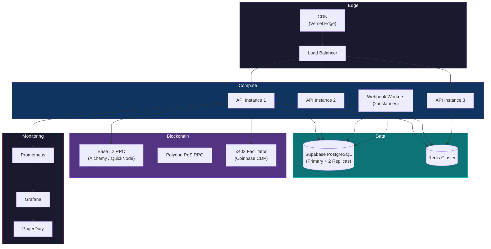

### Docker (Production)

```dockerfile
FROM node:20-alpine AS builder
WORKDIR /app
COPY package.json pnpm-lock.yaml ./
RUN npm install -g pnpm && pnpm install --frozen-lockfile
COPY . .
RUN pnpm build

FROM node:20-alpine
WORKDIR /app
COPY --from=builder /app/dist ./dist
COPY --from=builder /app/node_modules ./node_modules
COPY --from=builder /app/package.json ./
EXPOSE 3400
CMD ["node", "dist/server.js"]
```

### Railway / Fly.io

```bash
# Railway
railway init
railway link
railway up

# Fly.io
fly launch --image ghcr.io/xorb-xyz/xorb-api:latest
fly secrets set DATABASE_URL=postgresql://... CHAIN_RPC_URL=https://...
fly deploy
```

### Database Migrations

```bash
# Using Supabase CLI
npx supabase db push                  # Apply migrations
npx supabase db reset                 # Reset and reapply (dev only)
npx supabase db diff --schema public  # Generate migration from schema changes
```

### Scaling

| Component | Scaling Strategy | Notes |
|-----------|-----------------|-------|
| API Server | Horizontal (add instances) | Stateless — scale to match request volume |
| PostgreSQL | Vertical + read replicas | Write to primary, read from replicas |
| Redis | Horizontal (cluster mode) | Shard by agent ID |
| Webhook Workers | Horizontal | Independent queue consumers |
| Smart Contracts | N/A | Throughput limited by chain block time |

---

## Security

### Encryption

| Layer | Method |
|-------|--------|
| At rest | AES-256 (Supabase managed encryption) |
| In transit | TLS 1.3 (enforced, HSTS enabled) |
| Audit hashes | SHA-256, anchored on-chain |
| API keys | SHA-256 hashed before storage |
| Webhook signatures | HMAC-SHA256 |

### Authentication

- **SIWE (Sign-In With Ethereum)** — EIP-4361 wallet-based authentication. No passwords. No email.
- **API Keys** — SHA-256 hashed, scoped to specific permissions, rotatable, with expiration.
- Both methods produce a bearer token used in the `Authorization` header.

### Authorization

- **Sponsor-scoped RLS** — Every Supabase query is filtered by the authenticated sponsor's wallet address via Row Level Security. Sponsors can only read/write their own agents, actions, and configurations.
- **Agent-scoped actions** — Agents can only execute actions permitted by their gate configuration. The 8-gate pipeline enforces this on every request.

### Rate Limiting (Three Layers)

| Layer | Scope | Limit | Backend |
|-------|-------|-------|---------|
| IP | Per source IP | 1,000 requests/minute | Nginx / CDN |
| Wallet | Per sponsor wallet | 500 requests/minute | Redis |
| Agent | Per agent (Gate 2) | Configurable per agent | Redis |

### Economic Security

- USDC bonds create real financial stake
- Automated slashing removes human delay from enforcement
- Graduated severity prevents over-punishment for minor issues
- 50/50 slash distribution incentivizes sponsor monitoring
- Bond requirements scale with agent permissions

### Agent Containment

The 8-gate pipeline ensures no agent can:
- Execute actions outside its role (Gate 1)
- Exceed its rate limit (Gate 2)
- Spend more than its cap (Gate 3)
- Access resources outside its scope (Gate 4)
- Skip audit logging (Gate 5 — always runs)
- Bypass human approval requirements (Gate 6)
- Operate after its access expires (Gate 7)
- Perform actions above its reputation tier (Gate 8)

### Vulnerability Disclosure

- **Email**: security@xorb.xyz
- **Response time**: 24 hours for initial acknowledgment
- **Responsible disclosure**: 90-day disclosure window
- **Scope**: API, smart contracts, SDKs, MCP server

---

## Roadmap

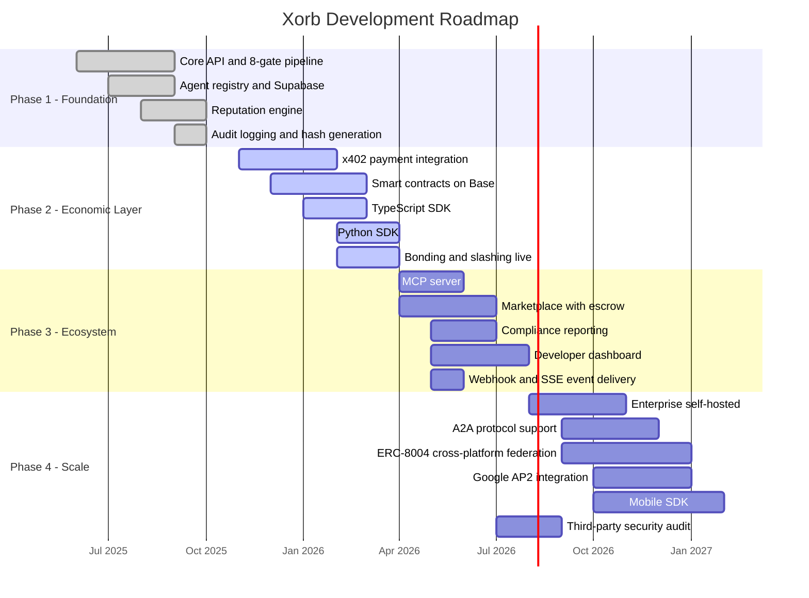

### Current Status

| Phase | Status | Key Milestone |
|-------|--------|---------------|
| Phase 1 — Foundation | Complete | 8-gate pipeline operational, reputation engine live |
| Phase 2 — Economic Layer | In Progress | x402 integrated, smart contracts in final testing on Base testnet |
| Phase 3 — Ecosystem | Next | MCP server and marketplace in design, compliance templates drafted |
| Phase 4 — Scale | Future | Enterprise architecture planned, A2A/AP2 research underway |

---

## Ecosystem

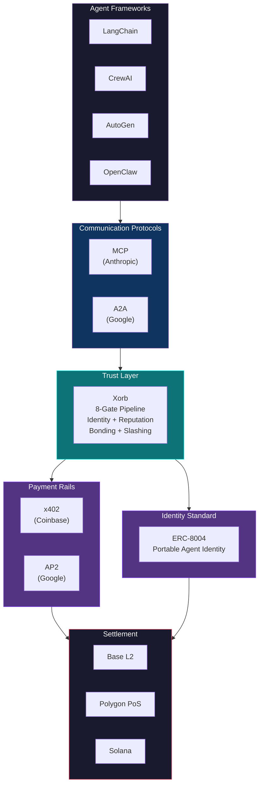

### Protocol Compatibility

| Protocol | Relationship | Status |
|----------|-------------|--------|
| **x402** (Coinbase) | Xorb uses x402 for all paid API calls. Xorb is a resource server in the x402 ecosystem — any x402-enabled client can pay for Xorb API access without API keys or subscriptions. | Live |
| **ERC-8004** | Agent identities registered on Xorb are ERC-8004 compatible. Level 4 verified agents receive an ERC-8004 NFT encoding their reputation, capabilities, and verification status. This identity is portable to any ERC-8004 compatible platform (SATI, Signet, AgentFolio). | Live |
| **MCP** (Anthropic) | The `@xorb/mcp` server wraps the 8-gate pipeline as MCP tools. Any MCP-connected agent gets security gating without code changes. | Phase 3 |
| **A2A** (Google) | Planned: Xorb's webhook/event system will emit and receive A2A-formatted messages, enabling agent-to-agent communication through Xorb's security layer. | Phase 4 |
| **AP2** (Google) | Planned: Xorb's Gate 6 (Human Override) maps directly to AP2's mandate concept — human approval for high-value agent actions. Integration will allow AP2 mandates to flow through the Xorb pipeline. | Phase 4 |
| **SATI** (Solana) | Xorb reputation data is interoperable with SATI's trust scores via ERC-8004 bridging. Agents with Xorb reputation can present verifiable trust credentials on Solana-based platforms. | Phase 4 |
| **Signet** | Signet's agent identity attestations can be consumed by Xorb as external verification signals. Xorb can export agent profiles in Signet-compatible formats. | Phase 4 |

---

## Business Model

### Pricing

| Tier | Price | Includes |
|------|-------|----------|
| **Free** | $0 | 1,000 gate checks/month, 5 agents, basic audit logs, community support |
| **Pay-per-use** | Per-action | $0.005/gate check, $0.10/registration, $0.001/reputation query, $0.25/compliance report |
| **Enterprise** | $2,000 - $10,000/month | Self-hosted deployment, custom gates, SLA (99.9%), dedicated support, compliance package |

### Revenue Streams

| Stream | Mechanism |
|--------|-----------|
| Gate checks | x402 micropayments per API call |
| Marketplace fees | 2% of escrow on completed engagements |
| Compliance reports | Per-report fee for formatted exports |
| Enterprise licenses | Monthly subscription for self-hosted + SLA |
| Bond custody | (Future) Yield on custodied USDC bonds via compliant DeFi strategies |

**No custom token. No speculation. USDC only.** Revenue is generated from infrastructure usage, not token appreciation. Every dollar of revenue comes from a developer or enterprise paying for a service they use.

---

## Comparison

| Feature | Xorb | SATI | Signet | Superagent | Arcade | CyberArk | DIY |
|---------|------|------|--------|------------|--------|----------|-----|
| 8-gate security pipeline | Yes | No | No | Partial | No | Partial | Build yourself |
| Economic bonding (USDC) | Yes | SOL-based | No | No | No | No | Build yourself |
| Automated slashing | Yes | Planned | No | No | No | No | Build yourself |
| Portable reputation (ERC-8004) | Yes | Custom | Attestations | No | No | No | No |
| x402 payments | Yes | No | No | No | No | No | No |
| MCP integration | Yes | No | No | No | Yes | No | Build yourself |
| Marketplace with escrow | Yes | No | No | No | No | No | Build yourself |
| Compliance reporting (EU AI Act) | Yes | No | No | No | No | Partial | Build yourself |
| Agent identity profiles | Full | Basic | Attestation-based | No | No | Enterprise IAM | Build yourself |
| Kill switch | Yes | No | No | No | No | Yes | Build yourself |
| On-chain audit anchoring | Yes | No | No | No | No | No | Build yourself |
| SDK (TypeScript + Python) | Yes | TypeScript | No | Python | TypeScript | Multiple | N/A |
| Human-in-the-loop gate | Yes | No | No | No | No | Yes | Build yourself |
| API-first (no UI required) | Yes | Yes | Yes | Partial | Yes | No | Depends |
| Per-action payments | Yes (x402) | No | No | No | No | No | No |
| Primary chain | Base | Solana | Ethereum | N/A | N/A | N/A | Depends |

---

## Contributing

### Getting Started

```bash
git clone https://github.com/xorb-xyz/xorb.git
cd xorb
pnpm install
pnpm dev
```

### Development Workflow

1. Fork the repository
2. Create a feature branch: `git checkout -b feature/your-feature`
3. Make changes following the code style guidelines
4. Write tests (see testing requirements below)
5. Submit a pull request against `main`

### Code Style

- **TypeScript**: strict mode, ESLint (Airbnb base), Prettier (2-space indent, trailing commas)
- **Solidity**: solhint, NatSpec documentation on all public functions
- **Python**: black, isort, mypy strict

### Testing Requirements

- **Gate logic**: Unit tests for every gate, covering pass, fail, and edge cases
- **Pipeline integration**: End-to-end tests for the full 8-gate pipeline with mock and real databases
- **SDK**: Integration tests against a local API instance
- **Smart contracts**: Hardhat tests with full coverage for all state transitions
- **MCP server**: Tool-level tests for each exposed MCP tool

```bash
pnpm test              # All tests
pnpm test:gates        # Gate unit tests
pnpm test:pipeline     # Pipeline integration tests
pnpm test:contracts    # Smart contract tests
pnpm test:sdk          # SDK integration tests
```

### Issue Labels

| Label | Description |
|-------|-------------|
| `bug` | Something is broken |
| `feature` | New functionality |
| `gate-logic` | Related to the 8-gate pipeline |
| `reputation` | Reputation engine changes |
| `contracts` | Smart contract work |
| `sdk` | TypeScript or Python SDK |
| `mcp` | MCP server |
| `docs` | Documentation |
| `x402` | Payment integration |

### Architecture Decision Records

Significant design decisions are documented as ADRs in `docs/adr/`. Before proposing a major architectural change, open an issue for discussion, then submit the ADR as part of your PR.

### Code of Conduct

We follow the [Contributor Covenant](https://www.contributor-covenant.org/version/2/1/code_of_conduct/). Be respectful, constructive, and professional.

---

## License & Legal

### Licensing

| Component | License |
|-----------|---------|
| TypeScript SDK (`@xorb/sdk`) | MIT |
| Python SDK (`xorb-sdk`) | MIT |
| MCP Server (`@xorb/mcp`) | MIT |
| Smart Contracts | MIT |
| Core API Server | BSL 1.1 (Business Source License) — converts to MIT after 3 years |
| Documentation | CC BY 4.0 |

### Data Processing

- Agent data (actions, reputation, violations) is stored in sponsor-scoped Supabase instances with Row Level Security.
- Agents are not natural persons — agent data is not personal data under GDPR.
- Sponsor data (wallet addresses, API keys, webhook URLs) follows standard GDPR practices: right to access, right to deletion, data portability.
- Audit hashes anchored on-chain are irreversible by design — this is a feature, not a limitation. The hash contains no personally identifiable information.

### GDPR

- **Data controller**: Sponsor (the entity deploying agents)
- **Data processor**: Xorb (processes agent actions on behalf of sponsors)
- **DPA**: Available on request for enterprise customers

---

## Links & Contact

| Resource | URL |
|----------|-----|
| Main site | [xorb.xyz](https://xorb.xyz) |
| Documentation | [docs.xorb.xyz](https://docs.xorb.xyz) |
| API base | [api.xorb.xyz](https://api.xorb.xyz) |
| Dashboard | [dashboard.xorb.xyz](https://dashboard.xorb.xyz) |
| Web3 identity | [x.orb](https://x.orb) (Handshake TLD) |
| GitHub | [github.com/xorb-xyz](https://github.com/xorb-xyz) |
| npm | [@xorb/sdk](https://www.npmjs.com/package/@xorb/sdk), [@xorb/mcp](https://www.npmjs.com/package/@xorb/mcp) |
| PyPI | [xorb-sdk](https://pypi.org/project/xorb-sdk/) |
| Discord | [discord.gg/xorb](https://discord.gg/xorb) |
| Twitter/X | [@xorb_xyz](https://x.com/xorb_xyz) |
| Email | hello@xorb.xyz |
| Security | security@xorb.xyz |
| Status | [status.xorb.xyz](https://status.xorb.xyz) |

---

<div align="center">

**Every agent action, verified.**

[Get Started](https://dashboard.xorb.xyz) · [Documentation](https://docs.xorb.xyz) · [API Reference](https://docs.xorb.xyz/api) · [Discord](https://discord.gg/xorb)

</div>
