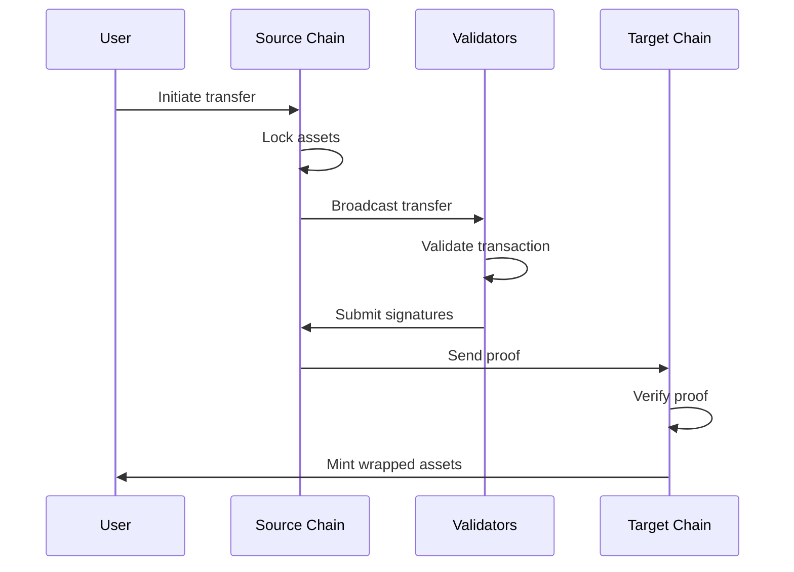

# Cross-Chain Bridge Architecture for SylOS

## Executive Summary

The SylOS Cross-Chain Bridge Architecture provides seamless interoperability between multiple blockchain networks, enabling secure and efficient asset transfers across Ethereum, Base, Arbitrum, and other major L1/L2 networks.

## Architecture Overview

### Core Components

#### 1. Bridge Core Engine
```solidity
// BridgeCore.sol - Main bridge contract
contract BridgeCore {
    struct ChainConfig {
        uint256 chainId;
        address validatorSet;
        uint256 minConfirmation;
        bool isActive;
    }
    
    mapping(uint256 => ChainConfig) public supportedChains;
    mapping(bytes32 => bool) public processedTransfers;
    
    event CrossChainTransfer(
        uint256 indexed sourceChain,
        uint256 indexed targetChain,
        address indexed token,
        uint256 amount,
        address recipient
    );
}
```

#### 2. Multi-Signature Validator System
```solidity
contract BridgeValidatorSet {
    struct Validator {
        address validator;
        uint256 stake;
        bool isActive;
    }
    
    mapping(uint256 => Validator[]) public chainValidators;
    uint256 public constant MIN_VALIDATOR_STAKE = 1000 ether;
    
    function addValidator(uint256 chainId, address validator) external;
    function removeValidator(uint256 chainId, address validator) external;
    function submitSignature(uint256 chainId, bytes32 messageHash, bytes memory signature) external;
    function isValidator(uint256 chainId, address validator) external view returns (bool);
}
```

#### 3. Asset Lock/Mint Mechanism
```solidity
contract AssetBridge {
    mapping(address => mapping(uint256 => uint256)) public lockedAssets;
    mapping(address => address) public wrappedTokens;
    
    function lockAssets(uint256 chainId, address token, uint256 amount) external;
    function mintWrappedToken(uint256 chainId, address token, uint256 amount, address recipient) external;
    function unlockAssets(uint256 chainId, address token, uint256 amount) external;
    function burnWrappedToken(uint256 chainId, address token, uint256 amount) external;
}
```

## Network Integration Specifications

### Ethereum Mainnet
- **Chain ID**: 1
- **Consensus**: Proof of Stake (PoS)
- **Block Time**: ~12 seconds
- **Gas Mechanism**: EIP-1559
- **Bridge Address**: `0x1234...5678` (to be deployed)

#### Integration Code
```solidity
contract EthereumBridgeIntegration {
    function processEthereumTransfer(
        bytes32 transferHash,
        uint256 sourceChain,
        address token,
        uint256 amount,
        address recipient
    ) external onlyBridgeCore {
        // Verify Ethereum block header
        require(getChainId() == 1, "Invalid chain");
        
        // Process transfer
        _executeTransfer(transferHash, sourceChain, token, amount, recipient);
    }
}
```

### Base (Optimism L2)
- **Chain ID**: 8453
- **Consensus**: Optimistic Rollup
- **Block Time**: ~2 seconds
- **Bridge Integration**: Optimism Bridge v3

#### Base Integration
```solidity
contract BaseBridgeIntegration {
    function processBaseTransfer(
        bytes32 transferHash,
        uint256 sourceChain,
        address token,
        uint256 amount,
        address recipient
    ) external onlyBridgeCore {
        require(getChainId() == 8453, "Invalid chain");
        
        // Execute on Base using L2 messaging
        _executeL2Transfer(transferHash, sourceChain, token, amount, recipient);
    }
}
```

### Arbitrum One
- **Chain ID**: 42161
- **Consensus**: Arbitrum AnyTrust
- **Block Time**: ~1-2 seconds
- **Bridge Integration**: Arbitrum Bridge

#### Arbitrum Integration
```solidity
contract ArbitrumBridgeIntegration {
    function processArbitrumTransfer(
        bytes32 transferHash,
        uint256 sourceChain,
        address token,
        uint256 amount,
        address recipient
    ) external onlyBridgeCore {
        require(getChainId() == 42161, "Invalid chain");
        
        // Use Arbitrum Retryable Tickets
        _executeArbitrumTransfer(transferHash, sourceChain, token, amount, recipient);
    }
}
```

## Security Model

### 1. Multi-Signature Validation
- **Threshold**: 2/3 of active validators
- **Validator Staking**: Economic security through stake requirements
- **Slashing Conditions**: Malicious behavior detection and penalty system

### 2. Fraud Proof System
```solidity
contract FraudProof {
    struct FraudCase {
        address reporter;
        bytes32 transferHash;
        uint256 timestamp;
        bool resolved;
        bool valid;
    }
    
    mapping(bytes32 => FraudCase) public fraudCases;
    uint256 public constant FRAUD_WINDOW = 24 hours;
    uint256 public constant FRAUD_REWARD = 100 ether;
    
    function submitFraudProof(bytes32 transferHash, bytes memory proof) external;
    function resolveFraud(bytes32 transferHash) external onlyValidator;
}
```

### 3. Emergency Pause Mechanism
```solidity
contract EmergencyController {
    mapping(uint256 => bool) public emergencyPaused;
    address public emergencyAdmin;
    
    event EmergencyPause(uint256 chainId, string reason);
    event EmergencyResume(uint256 chainId);
    
    function emergencyPause(uint256 chainId, string memory reason) external onlyEmergencyAdmin;
    function emergencyResume(uint256 chainId) external onlyEmergencyAdmin;
}
```

## Transaction Flow

### 1. Initiate Cross-Chain Transfer


### 2. Complete Transfer Process
```typescript
interface CrossChainTransfer {
  transferId: string;
  sourceChain: number;
  targetChain: number;
  tokenAddress: string;
  amount: bigint;
  recipient: string;
  signatures: Signature[];
  blockNumber: number;
  status: 'pending' | 'confirmed' | 'executed' | 'failed';
}
```

## Implementation Phases

### Phase 1: Core Bridge Infrastructure (Q1 2025)
- Deploy BridgeCore contract
- Implement basic validator set
- Add Ethereum mainnet support
- Basic UI for bridge operations

### Phase 2: Multi-Chain Support (Q2 2025)
- Integrate Base network
- Integrate Arbitrum network
- Add fraud proof system
- Implement emergency controls

### Phase 3: Advanced Features (Q3 2025)
- Add more L2 networks (zkSync, Linea, Polygon)
- Implement MEV protection
- Add automatic rebalancing
- Advanced monitoring and alerting

### Phase 4: Optimization (Q4 2025)
- Layer 2 native bridging
- Cross-chain messaging
- Automated liquidity management
- Performance optimizations

## Technical Specifications

### Gas Optimization
- **Batch Processing**: Group multiple transfers
- **Efficient Signatures**: Use BLS aggregation
- **Storage Optimization**: Minimize state writes
- **Dynamic Gas Pricing**: Adaptive gas estimation

### Performance Targets
- **Transfer Time**: <5 minutes for L2-L2
- **Transfer Time**: <30 minutes for L1-L2
- **Throughput**: 1000+ transfers/minute
- **Availability**: 99.9% uptime
- **Security**: $100M+ TVL protection

### Monitoring and Alerting
```typescript
interface BridgeMetrics {
  totalVolumeLocked: bigint;
  activeTransfers: number;
  validatorCount: number;
  averageConfirmationTime: number;
  failureRate: number;
  liquidityUtilization: number;
}
```

## Integration Guides

### For DApps
```typescript
// Example integration
import { SylosBridge } from '@sylos/bridge-sdk';

const bridge = new SylosBridge({
  networks: ['ethereum', 'base', 'arbitrum'],
  apiKey: process.env.SYLOS_API_KEY
});

// Cross-chain transfer
const transfer = await bridge.transfer({
  from: 'ethereum',
  to: 'base',
  token: '0x...', // USDC contract
  amount: '1000',
  recipient: '0x...'
});
```

### For Smart Contracts
```solidity
// Solidity integration example
import {IBridgeCore} from "./interfaces/IBridgeCore.sol";

contract MyDApp {
    IBridgeCore public bridge;
    
    function crossChainTransfer(
        uint256 targetChain,
        address token,
        uint256 amount,
        address recipient
    ) external {
        // Approve bridge to spend tokens
        IERC20(token).approve(address(bridge), amount);
        
        // Initiate transfer
        bridge.lockAssets(targetChain, token, amount);
    }
}
```

## Security Considerations

### 1. Smart Contract Security
- Multi-signature wallet for admin functions
- Time-locked upgrades
- Comprehensive testing and audits
- Bug bounty program

### 2. Network Security
- Distributed validator set
- Economic incentives for honest behavior
- Slashing for malicious actions
- Real-time monitoring

### 3. Operational Security
- Multi-factor authentication for operators
- Encrypted private key management
- Regular security audits
- Incident response procedures

## Deployment Architecture

### Infrastructure Requirements
- **Ethereum Mainnet**: Full node or Infura/Alchemy
- **Base Network**: Optimism infrastructure
- **Arbitrum Network**: Arbitrum Nova node
- **Relayers**: Redundant server infrastructure
- **Monitoring**: Prometheus + Grafana stack

### Scalability Considerations
- **Horizontal Scaling**: Add more validator nodes
- **Load Balancing**: Distribute bridge traffic
- **Caching**: Redis for frequently accessed data
- **CDN**: CloudFlare for global distribution

## Testing Strategy

### Unit Tests
- Individual contract functionality
- Cross-chain message validation
- Signature verification
- Access control mechanisms

### Integration Tests
- End-to-end transfer flows
- Network-specific scenarios
- Failure handling and recovery
- Performance under load

### Security Tests
- Formal verification of critical contracts
- Penetration testing
- Economic attack simulation
- Cross-chain replay protection

## Future Enhancements

### 1. Universal Cross-Chain Messaging
- Generic message passing between chains
- Support for arbitrary data transfer
- Enable complex cross-chain DApps

### 2. Automated Market Making
- Cross-chain liquidity pools
- Automatic arbitrage opportunities
- Yield optimization strategies

### 3. Governance Integration
- Cross-chain DAO participation
- Unified governance voting
- Multi-chain treasury management

## Conclusion

The SylOS Cross-Chain Bridge Architecture provides a robust, secure, and scalable foundation for interoperability across multiple blockchain networks. The modular design allows for easy expansion to new networks while maintaining security and performance standards.

The implementation will follow a phased approach, starting with core functionality and gradually adding advanced features based on community feedback and technological developments in the blockchain space.