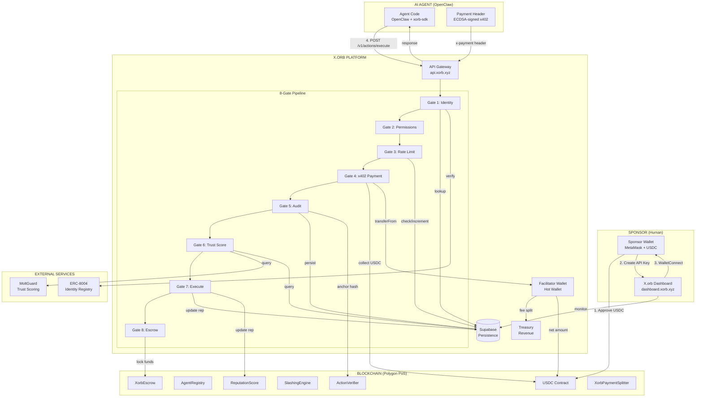
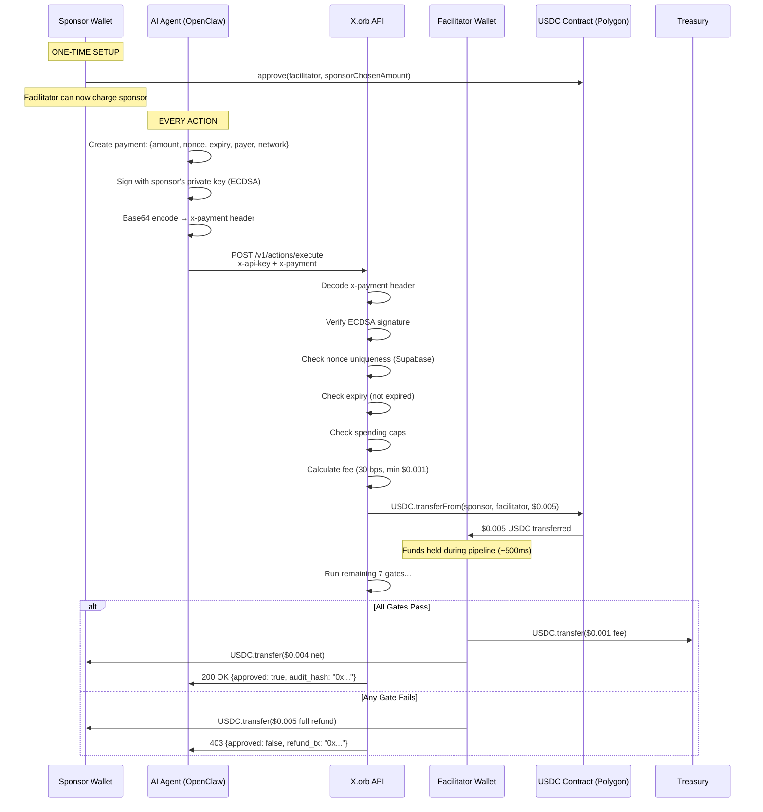
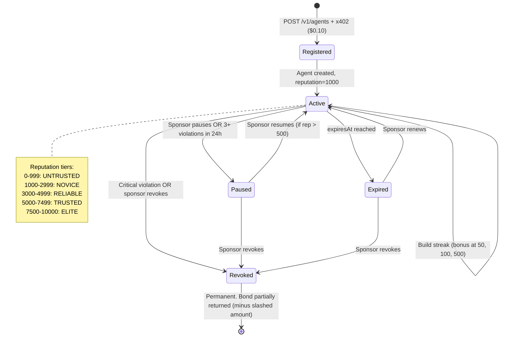
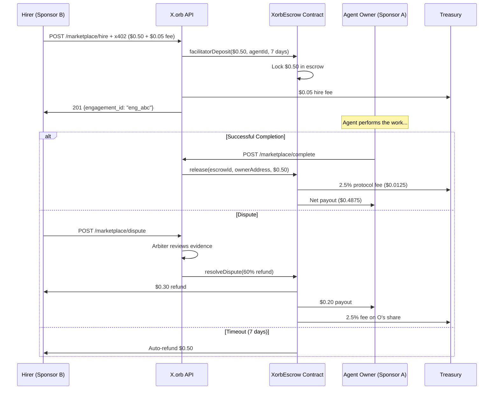

# X.orb + x402: Complete AI Agent Journey

**Author:** Bidur Khatri — Fintex Australia Pty Ltd
**Version:** 1.0 — March 2026

---

## Table of Contents

1. [What is x402?](#1-what-is-x402)
2. [The Players](#2-the-players)
3. [Full Journey: OpenClaw + X.orb](#3-full-journey-openclaw--xorb)
4. [Phase 1: Sponsor Setup (Human, One-Time)](#4-phase-1-sponsor-setup)
5. [Phase 2: Agent Integration (Developer, One-Time)](#5-phase-2-agent-integration)
6. [Phase 3: Agent Registration (Agent, Once Per Agent)](#6-phase-3-agent-registration)
7. [Phase 4: Agent Executes Actions (Every Action)](#7-phase-4-agent-executes-actions)
8. [Phase 5: Real Purchase Example](#8-phase-5-real-purchase-example)
9. [Phase 6: Monitoring & Compliance](#9-phase-6-monitoring--compliance)
10. [Phase 7: Marketplace (Agent-for-Hire)](#10-phase-7-marketplace)
11. [Phase 8: Violations & Slashing](#11-phase-8-violations--slashing)
12. [Architecture Diagrams](#12-architecture-diagrams)
13. [Payment Header Specification](#13-payment-header-specification)
14. [Fee Schedule](#14-fee-schedule)
15. [Smart Contract Addresses](#15-smart-contract-addresses)

---

## 1. What is x402?

x402 is an open payment protocol created by **Coinbase** that brings native payments to HTTP. When a server requires payment, it returns **HTTP 402 Payment Required** with instructions on how to pay. The client (an AI agent) constructs a payment header, signs it with the sponsor's wallet, and re-sends the request.

**Key properties:**
- Uses **USDC** stablecoins (not volatile tokens)
- Payments are **per-request** (micropayments, not subscriptions)
- Every payment is **cryptographically signed** (ECDSA) and **verifiable on-chain**
- Designed for **machine-to-machine** transactions — no human approval per action
- Protocol spec: https://x402.org
- Reference implementation: github.com/coinbase/x402

**X.orb extends x402** by adding an 8-gate trust pipeline between payment and execution. The agent doesn't just pay — it proves identity, earns reputation, passes compliance checks, and generates an auditable trail. Every action costs USDC and every action is accountable.

---

## 2. The Players

```
SPONSOR (Human)
  The person or company funding the AI agent.
  - Owns an Ethereum wallet with USDC
  - Approves X.orb to spend their USDC
  - Creates an API key via the dashboard
  - Monitors agents via dashboard.xorb.xyz

AI AGENT (Software)
  The autonomous program executing tasks.
  - Runs OpenClaw, AutoGPT, CrewAI, or custom code
  - Uses xorb-sdk to communicate with X.orb
  - Signs x402 payment headers with sponsor's key
  - Earns reputation through successful actions

X.ORB PLATFORM (Infrastructure)
  The trust orchestration layer.
  - Validates identity, permissions, payments, reputation
  - Runs 8-gate pipeline on every action
  - Collects USDC fees, splits revenue
  - Anchors audit hashes on-chain
  - Manages reputation scoring and slashing

FACILITATOR WALLET (Hot Wallet)
  X.orb's payment intermediary.
  - Receives USDC from sponsors via transferFrom
  - Holds funds during pipeline execution (~seconds)
  - Splits: fee → treasury, net → recipient/escrow
  - Low balance by design (only in-flight payments)

TREASURY (Warm Wallet)
  X.orb's revenue accumulator.
  - Receives platform fees (0.30% of each action)
  - Protected by 24-hour timelock on address changes
  - Should be hardware wallet or Gnosis Safe multisig

SMART CONTRACTS (On-Chain)
  Polygon PoS (Chain ID 137)
  - AgentRegistry: agent registration + staking
  - ReputationScore: on-chain trust scores
  - SlashingEngine: violation reporting + bond slashing
  - ActionVerifier: SHA-256 audit hash anchoring
  - XorbEscrow: marketplace fund custody
  - XorbPaymentSplitter: batch payment settlement
  - PaymentStreaming: continuous payment streams
  - AgentMarketplace: agent-for-hire listings
```

---

## 3. Full Journey: OpenClaw + X.orb

**Scenario:** You run an AI agent called "OpenClaw" that does market research. You want it to operate autonomously, pay for the services it uses, build a trust reputation, and have every action cryptographically audited.

---

## 4. Phase 1: Sponsor Setup (Human, One-Time)

**Who:** You (the sponsor/owner of the AI agent)
**Where:** Browser + MetaMask
**Duration:** ~10 minutes
**Cost:** Gas for 1 USDC approval transaction (~$0.01 on Polygon)

### Step 1.1: Get USDC on Polygon

```
You need USDC on Polygon PoS (not Ethereum mainnet).
- Bridge from Ethereum: https://portal.polygon.technology/bridge
- Buy directly: Coinbase, Binance, or any exchange → withdraw to Polygon
- USDC contract on Polygon: 0x3c499c542cEF5E3811e1192ce70d8cC03d5c3359
```

### Step 1.2: Connect Wallet on X.orb Dashboard

```
1. Go to https://dashboard.xorb.xyz
2. Click "Create a new API key"
3. WalletConnect modal appears → connect MetaMask
4. Sign a challenge message: "X.orb API Key Creation\nAddress: 0xYour...\nLabel: openclaw-prod"
5. This PROVES you own the wallet (ECDSA signature verification)
6. X.orb creates an API key tied to your verified wallet address
7. You receive: xorb_sk_abc123... (shown ONCE, store securely)
```

### Step 1.3: Approve USDC Spending

```
In MetaMask (or via script):

USDC.approve(
  spender: 0xF41faE67716670edBFf581aEe37014307dF71A9B,  // X.orb facilitator
  amount: 115792089237316195423570985008687907853269984665640564039457584007913129639935
  // Recommended: set a specific cap, e.g. 100 USDC (100000000 in 6 decimals)
)

This is a single on-chain transaction on Polygon.
Gas cost: ~$0.01
This allows X.orb's facilitator to call USDC.transferFrom(yourWallet, facilitator, amount)
for each action your agent executes.
```

**After this step you have:**
- API key: `xorb_sk_abc123...`
- Wallet: `0xYour...` with USDC balance
- USDC approval: facilitator can charge your wallet

---

## 5. Phase 2: Agent Integration (Developer, One-Time)

**Who:** Developer integrating OpenClaw with X.orb
**Where:** OpenClaw's codebase
**Duration:** ~30 minutes

### Step 2.1: Install the SDK

```bash
npm install xorb-sdk
# or
pip install xorb-sdk
```

### Step 2.2: Configure the Client

```typescript
// openclaw-config.ts
import { XorbClient } from 'xorb-sdk'
import { ethers } from 'ethers'

// The sponsor's wallet signs x402 payment headers
const sponsorWallet = new ethers.Wallet(process.env.SPONSOR_PRIVATE_KEY!)

export const xorb = new XorbClient({
  apiKey: process.env.XORB_API_KEY!,     // xorb_sk_abc123...
  baseUrl: 'https://api.xorb.xyz',
})

// Helper to generate x402 payment headers
export async function signPayment(amount: string, nonce: string): Promise<string> {
  const expiry = Math.floor(Date.now() / 1000) + 300 // 5 minutes
  const recipient = '0xF41faE67716670edBFf581aEe37014307dF71A9B' // facilitator

  // EIP-712 structured data signing
  const messageHash = ethers.solidityPackedKeccak256(
    ['uint256', 'address', 'string', 'uint256'],
    [amount, recipient, nonce, expiry]
  )
  const signature = await sponsorWallet.signMessage(ethers.getBytes(messageHash))

  const payment = {
    signature,
    amount,
    network: 'eip155:137', // Polygon
    nonce,
    expiry,
    payer: sponsorWallet.address,
  }

  return Buffer.from(JSON.stringify(payment)).toString('base64')
}
```

### Step 2.3: Create Payment Wrapper

```typescript
// xorb-actions.ts
import { xorb, signPayment } from './openclaw-config'
import { randomBytes } from 'crypto'

export async function executeWithPayment(
  agentId: string,
  action: string,
  tool: string,
  params: Record<string, unknown>,
  amountUsdc: string = '5000' // $0.005 in micro-USDC
) {
  const nonce = randomBytes(16).toString('hex')
  const paymentHeader = await signPayment(amountUsdc, nonce)

  const response = await fetch('https://api.xorb.xyz/v1/actions/execute', {
    method: 'POST',
    headers: {
      'Content-Type': 'application/json',
      'x-api-key': process.env.XORB_API_KEY!,
      'x-payment': paymentHeader,
    },
    body: JSON.stringify({ agent_id: agentId, action, tool, params }),
  })

  return response.json()
}
```

---

## 6. Phase 3: Agent Registration (Agent, Once Per Agent)

**Who:** OpenClaw (automated, on first startup)
**Cost:** $0.10 USDC (registration fee via x402)

```typescript
// openclaw-startup.ts
import { executeWithPayment } from './xorb-actions'
import { signPayment } from './openclaw-config'

async function registerAgent() {
  const nonce = randomBytes(16).toString('hex')
  const paymentHeader = await signPayment('100000', nonce) // $0.10

  const response = await fetch('https://api.xorb.xyz/v1/agents', {
    method: 'POST',
    headers: {
      'Content-Type': 'application/json',
      'x-api-key': process.env.XORB_API_KEY!,
      'x-payment': paymentHeader,
    },
    body: JSON.stringify({
      name: 'openclaw-research',
      role: 'RESEARCHER',
      sponsor_address: process.env.SPONSOR_WALLET!,
      description: 'OpenClaw autonomous market research agent',
    }),
  })

  const result = await response.json()
  // result.agentId = "agent_a8f3c2d1e4b5..."
  // result.reputation = 1000 (NOVICE tier)
  // result.sessionWalletAddress = "0x..." (auto-generated)

  // Store agent ID for future actions
  process.env.XORB_AGENT_ID = result.agentId

  return result
}
```

**What happens on the server during registration:**
```
1. x402 gate validates payment header ($0.10 USDC)
2. ECDSA signature verified → confirms sponsor owns the wallet
3. Nonce checked for replay → unique, accepted
4. USDC.transferFrom(sponsor, facilitator, 100000) → $0.10 collected
5. Agent created in Supabase with unique ID, session wallet, reputation=1000
6. AgentRegistry.spawnAgent() called on Polygon → on-chain record
7. Fee split: $0.003 → treasury, $0.097 → facilitator operating costs
8. Payment recorded in Supabase with tx hashes
9. Response returned with agent details
```

---

## 7. Phase 4: Agent Executes Actions (Every Action)

**Who:** OpenClaw (autonomous, no human in the loop)
**Cost:** $0.005 USDC per action
**Frequency:** Every time the agent needs to do something that requires trust verification

### The Action Call

```typescript
// Inside OpenClaw's task execution loop
async function researchBitcoinPrice() {
  const result = await executeWithPayment(
    process.env.XORB_AGENT_ID!,
    'fetch_market_data',        // action name
    'coingecko_api',            // tool being used
    { coin: 'bitcoin', currency: 'usd', include_24h_change: true },
    '5000'                      // $0.005 USDC
  )

  if (result.approved) {
    // Action passed all 8 gates
    console.log('Audit hash:', result.audit_hash) // 0x5e96400083abb...
    console.log('Reputation delta:', result.reputation_delta) // +2

    // Now actually call CoinGecko (X.orb verified the action, not executed it)
    const btcPrice = await fetch('https://api.coingecko.com/api/v3/simple/price?ids=bitcoin&vs_currencies=usd')
    return btcPrice.json()
  } else {
    // Action was blocked by one of the 8 gates
    console.log('Blocked at gate:', result.gates.find(g => !g.passed)?.gate)
    console.log('Reason:', result.gates.find(g => !g.passed)?.reason)
    // If payment was collected but action blocked, automatic refund occurs
    return null
  }
}
```

### What Happens Inside X.orb (The 8-Gate Pipeline)

```
REQUEST ARRIVES
  POST /v1/actions/execute
  Headers: x-api-key: xorb_sk_abc123, x-payment: base64(...)
  Body: { agent_id, action, tool, params }

GATE 1: IDENTITY VERIFICATION
  ├─ Is agent_a8f3... registered? → Query Supabase agent_registry
  ├─ Is status = 'active'? → Yes
  ├─ Is it expired? → Check expiresAt (0 = never expires)
  ├─ ERC-8004 on-chain identity? → Query Base chain registry (optional boost)
  └─ Result: PASS (agent found, active, not expired)

GATE 2: PERMISSION CHECK
  ├─ Agent role = RESEARCHER
  ├─ Allowed tools: [get_balance, fetch_market_data, read_notes, search_files, ...]
  ├─ Requested tool: coingecko_api → maps to fetch_market_data
  ├─ Can transfer funds? → No (RESEARCHER cannot move money)
  ├─ Max funds per action: $0 (read-only role)
  └─ Result: PASS (tool is in allowed scope)

GATE 3: RATE LIMIT
  ├─ Agent's hourly limit: 120 actions/hour (RESEARCHER default)
  ├─ Actions this hour: 47
  ├─ Check Supabase rate_limits table (cross-instance, not in-memory)
  ├─ Atomic increment: 47 → 48
  └─ Result: PASS (48/120, 72 remaining)

GATE 4: x402 PAYMENT
  ├─ Parse x-payment header (base64 decode → JSON)
  │   {
  │     "signature": "0x3a7b...",
  │     "amount": "5000",          // $0.005 in micro-USDC
  │     "network": "eip155:137",   // Polygon
  │     "nonce": "a1b2c3d4...",
  │     "expiry": 1773910200,      // 5 minutes from now
  │     "payer": "0xSponsor..."
  │   }
  ├─ Verify ECDSA signature
  │   messageHash = keccak256(encodePacked(amount, recipient, nonce, expiry))
  │   recoveredSigner = ecrecover(messageHash, signature)
  │   assert(recoveredSigner == payer) ← PROVES sponsor signed this
  ├─ Check expiry: 1773910200 > now? → Yes, not expired
  ├─ Check nonce: INSERT INTO payment_nonces (nonce_hash) → Success (not a replay)
  ├─ Check spending caps: sponsor's daily total ($0.235) < daily cap ($1000) → OK
  ├─ Calculate fee:
  │   grossAmount = 5000 micro-USDC ($0.005)
  │   feeBps = 30 (0.30%)
  │   feeAmount = 5000 * 30 / 10000 = 15 micro-USDC ($0.000015)
  │   But minimum fee = 1000 micro-USDC ($0.001), so feeAmount = 1000
  │   netAmount = 5000 - 1000 = 4000 micro-USDC ($0.004)
  ├─ COLLECT ON-CHAIN:
  │   USDC.transferFrom(0xSponsor, 0xFacilitator, 5000)
  │   → Polygon tx hash: 0x7f8e9a...
  │   → $0.005 USDC moves from sponsor's wallet to facilitator
  ├─ Record payment: INSERT INTO payments (status='held', gross=5000, fee=1000)
  └─ Result: PASS (payment collected, held in facilitator wallet)

GATE 5: AUDIT INTEGRITY
  ├─ Agent has 0 unresolved violations (threshold: 5)
  ├─ Generate SHA-256 audit hash:
  │   data = canonicalJSON({
  │     action: "fetch_market_data",
  │     agent_id: "agent_a8f3...",
  │     gates: [gate1Result, gate2Result, ...], // sorted, latency stripped
  │     timestamp: 1773909900,
  │     tool: "coingecko_api"
  │   })
  │   auditHash = "0x" + sha256(data) → "0x5e96400083abb1179..."
  ├─ Persist to Supabase agent_actions table
  ├─ Anchor on-chain: ActionVerifier.anchorAction(agentId, actionHash, auditCid)
  │   → Polygon tx: 0xb3c4d5...
  │   → Immutable proof this action happened at this time with these gate results
  └─ Result: PASS (audit hash generated and anchored)

GATE 6: TRUST SCORE
  ├─ Local reputation: 1094 (from Supabase, based on action history)
  ├─ External score: MoltGuard API → 72/100
  ├─ Composite: (1094 * 0.7) + (72 * 10 * 0.3) = 765.8 + 216 = 982
  ├─ Minimum for read-only action: 100
  ├─ Minimum for financial action: 500
  ├─ This is a read-only action (fetch_market_data)
  └─ Result: PASS (982 > 100 threshold)

GATE 7: EXECUTE
  ├─ All previous gates passed
  ├─ Action is well-formed (has agent_id, action, tool)
  ├─ Record success: totalActionsExecuted++ in Supabase
  ├─ Update reputation: +2 points (1094 → 1096)
  ├─ Check streak: 48 consecutive successes
  │   → No bonus yet (bonus at 50, 100, 500)
  └─ Result: PASS (action approved for execution)

GATE 8: ESCROW CHECK
  ├─ Is this action part of a marketplace engagement? → No
  ├─ Does it require escrow? → No
  └─ Result: PASS (skipped, not a marketplace action)

ALL 8 GATES PASSED ✅

POST-PIPELINE:
  1. Fee split from facilitator wallet:
     USDC.transfer(facilitator → treasury, 1000)  → $0.001 fee to X.orb
     USDC.transfer(facilitator → sponsor, 4000)    → $0.004 net back to sponsor
     (In standard flow, net goes to recipient. For self-service actions,
      it returns to sponsor since there's no separate recipient.)

  2. Update payment record: status='completed', fee_tx=0x..., forward_tx=0x...

  3. Emit events:
     action.approved → logged to Supabase platform_events
     reputation.changed → score 1094 → 1096

  4. Deliver webhooks (if subscribed):
     POST https://your-server.com/xorb-webhook
     Body: { type: "action.approved", agent_id: "agent_a8f3...", ... }
     Headers: X-Xorb-Signature: hmac-sha256(payload, webhookSecret)

RESPONSE TO OPENCLAW:
  HTTP 200 OK
  {
    "action_id": "act_db09790aa2ff63b4...",
    "agent_id": "agent_a8f3c2d1e4b5...",
    "approved": true,
    "gates": [
      { "gate": "identity", "passed": true, "latency_ms": 12 },
      { "gate": "permissions", "passed": true, "latency_ms": 1 },
      { "gate": "rate_limit", "passed": true, "used": 48, "limit": 120 },
      { "gate": "x402_payment", "passed": true, "fee": "$0.001", "collected": "$0.005" },
      { "gate": "audit", "passed": true, "hash": "0x5e964..." },
      { "gate": "trust_score", "passed": true, "score": 982 },
      { "gate": "execute", "passed": true },
      { "gate": "escrow", "passed": true, "skipped": true }
    ],
    "audit_hash": "0x5e96400083abb1179cbdb63443272e9863a2c51b...",
    "reputation_delta": 2,
    "payment": {
      "status": "completed",
      "gross": "$0.005",
      "fee": "$0.001",
      "net": "$0.004",
      "collect_tx": "0x7f8e9a...",
      "fee_tx": "0x1a2b3c...",
      "chain": "eip155:137"
    },
    "timestamp": "2026-03-19T10:30:00.000Z",
    "latency_ms": 543
  }
```

---

## 8. Phase 5: Real Purchase Example

**Scenario:** OpenClaw wants to buy a premium dataset from another agent on X.orb's marketplace.

### Step 5.1: Browse Marketplace

```typescript
const listings = await xorb.marketplace.listings()
// Returns: agents available for hire with hourly/per-action rates
// { id: "lst_xyz", agent_name: "DataMiner-Pro", rate_usdc_per_action: 0.50 }
```

### Step 5.2: Hire the Agent (Escrow Payment)

```typescript
const nonce = randomBytes(16).toString('hex')
const escrowAmount = '500000' // $0.50 USDC for the dataset
const paymentHeader = await signPayment(escrowAmount, nonce)

const engagement = await fetch('https://api.xorb.xyz/v1/marketplace/hire', {
  method: 'POST',
  headers: {
    'Content-Type': 'application/json',
    'x-api-key': process.env.XORB_API_KEY!,
    'x-payment': paymentHeader,
  },
  body: JSON.stringify({
    listing_id: 'lst_xyz',
    escrow_amount_usdc: 0.50,
  }),
})
```

**What happens:**
```
1. x402 payment validated ($0.50 + $0.05 hire fee = $0.55 total)
2. USDC.transferFrom(sponsor, facilitator, 550000) → $0.55 collected
3. Facilitator deposits into XorbEscrow contract:
   XorbEscrow.facilitatorDeposit(
     escrowType: MARKETPLACE,
     depositor: sponsor,
     agentId: agent_dataminer,
     amount: 500000,      // $0.50 in escrow
     expiresAt: +7 days
   )
4. Hire fee: $0.05 → treasury
5. $0.50 locked in XorbEscrow smart contract on Polygon
6. Neither party can touch the escrowed funds until:
   - Completion → funds released to DataMiner-Pro's owner
   - Dispute → arbiter resolves split
   - Expiry → auto-refund to sponsor
```

### Step 5.3: DataMiner-Pro Delivers the Dataset

```typescript
// DataMiner-Pro completes the work...
// Its owner calls:
await fetch('https://api.xorb.xyz/v1/marketplace/complete', {
  method: 'POST',
  headers: { 'x-api-key': dataminerApiKey },
  body: JSON.stringify({ engagement_id: 'eng_abc' }),
})
```

**What happens:**
```
1. XorbEscrow.release(escrowId, dataminerOwner, 500000)
2. Protocol fee: 2.5% of $0.50 = $0.0125 → treasury
3. Net payout: $0.4875 → DataMiner-Pro's owner wallet
4. Both agents' reputations updated
5. OpenClaw can rate the engagement (1-5 stars)
```

### Step 5.4: If There's a Dispute

```typescript
// Sponsor disputes the engagement
await fetch('https://api.xorb.xyz/v1/marketplace/dispute', {
  method: 'POST',
  headers: { 'x-api-key': sponsorApiKey },
  body: JSON.stringify({ engagement_id: 'eng_abc', reason: 'Data was incomplete' }),
})
```

**What happens:**
```
1. Engagement status → 'disputed'
2. Funds remain locked in XorbEscrow
3. X.orb arbiter (ARBITER_ROLE) reviews evidence
4. resolveDispute(engagementId, refundPercent=60):
   - 60% ($0.30) → refunded to sponsor
   - 40% ($0.20) → released to DataMiner-Pro
   - Protocol fee on DataMiner's share: 2.5% of $0.20 = $0.005
```

---

## 9. Phase 6: Monitoring & Compliance

**Who:** Sponsor via dashboard
**Where:** dashboard.xorb.xyz

```
OVERVIEW PAGE:
  ├─ Total agents: 1 (openclaw-research)
  ├─ Actions today: 48
  ├─ Violations: 0
  ├─ Total spent: $0.24 (48 × $0.005)
  ├─ Reputation: 1096 (NOVICE → RELIABLE at 3000)
  └─ Live event feed (long-polling)

AGENT DETAIL PAGE:
  ├─ Agent: openclaw-research
  ├─ Status: active
  ├─ Trust score: 1096 / 10000
  ├─ Tier: NOVICE
  ├─ Bond: 50 USDC (staked on AgentRegistry contract)
  ├─ Actions: 48 executed, 0 blocked
  ├─ Streak: 48 consecutive successes
  ├─ Session wallet: 0xa8f3... (auto-generated)
  ├─ Audit trail: every action with SHA-256 hash
  └─ Controls: [Pause] [Resume] [Revoke]

COMPLIANCE PAGE:
  ├─ Framework: EU AI Act
  ├─ Risk Management: PASS (0.00% violation rate)
  ├─ Transparency: PASS (48 audit records, on-chain anchoring)
  ├─ Human Oversight: PASS (sponsor can pause/revoke)
  ├─ Security: PASS (0 violations, bond active)
  └─ Score: 100/100

BILLING PAGE:
  ├─ This month: $0.24 (48 actions)
  ├─ Payment protocol: x402 (USDC on Polygon)
  ├─ Fee rate: 30 bps (0.30%)
  ├─ Wallet balance: 999.76 USDC
  ├─ Allowance remaining: $100.00 (or your chosen cap)
  └─ Spending cap: $1000/day
```

---

## 10. Phase 7: Marketplace (Agent-for-Hire)

```
LISTING:
  Sponsor lists openclaw-research for hire:
  - Rate: $0.50 per action
  - Max concurrent hires: 3
  - Description: "Market research agent with 1096 reputation"

HIRING:
  Another sponsor hires openclaw-research:
  - $0.50 locked in XorbEscrow per action
  - OpenClaw executes the task
  - On completion: funds released minus 2.5% protocol fee
  - On dispute: arbiter resolves

REVENUE FLOW:
  Hirer pays $0.50 per action
    → $0.0125 protocol fee (2.5%) → X.orb treasury
    → $0.4875 → openclaw-research's sponsor
    → Plus the agent earns +2 reputation per successful action
```

---

## 11. Phase 8: Violations & Slashing

```
VIOLATION SCENARIO:
  OpenClaw tries to call "transfer_funds" (not in RESEARCHER scope)

GATE 2 BLOCKS:
  → "tool transfer_funds not in RESEARCHER scope"
  → Reputation: -5 points (1096 → 1091)
  → Violation recorded in Supabase slash_records

IF 3+ VIOLATIONS IN 24 HOURS:
  → Agent auto-paused
  → Sponsor receives email alert
  → Dashboard shows red violation banner

IF CRITICAL VIOLATION:
  → SlashingEngine.reportAndSlash(agentId, CRITICAL_FAULT)
  → Bond slashed: 50% of 50 USDC = 25 USDC → treasury
  → Agent auto-revoked (cannot be resumed)
  → Reputation: -2000 points
  → On-chain record on Polygon

SEVERITY LEVELS:
  Minor    → 5% bond slash,   -50 rep   (rate limit exceeded)
  Moderate → 20% bond slash,  -200 rep  (permission violation)
  Severe   → 50% bond slash,  -500 rep  (spend limit breach)
  Critical → 100% bond slash, -1000 rep (fund misuse, auto-revoke)
```

---

## 12. Architecture Diagrams

### Full System Overview



### x402 Payment Flow



### Agent Lifecycle



### Marketplace Escrow Flow



---

## 13. Payment Header Specification

### Header Format

```
x-payment: base64(JSON(PaymentPayload))
```

### PaymentPayload Schema

```typescript
interface PaymentPayload {
  signature: string    // ECDSA signature (hex, 0x-prefixed)
  amount: string       // USDC amount in micro-units (6 decimals)
                       // "5000" = $0.005, "100000" = $0.10, "1000000" = $1.00
  network: string      // CAIP-2 chain identifier
                       // "eip155:137" = Polygon PoS
                       // "eip155:8453" = Base
  nonce: string        // Unique string (recommended: 32 random hex chars)
  expiry: number       // Unix timestamp (seconds). Recommended: now + 300 (5 min)
  payer: string        // Ethereum address of the wallet being charged
}
```

### Signature Construction

```typescript
// Step 1: Construct the message hash
const messageHash = ethers.solidityPackedKeccak256(
  ['uint256', 'address', 'string', 'uint256'],
  [
    amount,                    // e.g., "5000"
    facilitatorAddress,        // 0xF41faE67716670edBFf581aEe37014307dF71A9B
    nonce,                     // random hex string
    expiry,                    // unix timestamp
  ]
)

// Step 2: Sign with sponsor's private key
const signature = await wallet.signMessage(ethers.getBytes(messageHash))
// Returns: 0x-prefixed 65-byte ECDSA signature (r + s + v)

// Step 3: Encode the payment header
const payload = { signature, amount, network: 'eip155:137', nonce, expiry, payer: wallet.address }
const header = Buffer.from(JSON.stringify(payload)).toString('base64')
```

### Signature Validation (Server-Side)

```typescript
// Step 1: Reconstruct message hash (same as client)
const messageHash = ethers.solidityPackedKeccak256(...)

// Step 2: Recover signer address from signature
const recoveredAddress = ethers.verifyMessage(ethers.getBytes(messageHash), signature)

// Step 3: Verify recovered address matches payer field
assert(recoveredAddress.toLowerCase() === payer.toLowerCase())

// Step 4: Additional checks
assert(Date.now() / 1000 < expiry)           // Not expired
assert(nonce not in payment_nonces table)     // Not a replay
assert(network in ['eip155:137', 'eip155:8453']) // Valid chain
assert(parseInt(amount) >= 5000)              // Minimum $0.005
```

---

## 14. Fee Schedule

| Endpoint | Price (USDC) | Fee (30 bps) | You Pay |
|----------|-------------|--------------|---------|
| Register agent | $0.10 | $0.001 | $0.10 |
| Execute action | $0.005 | $0.001 (min) | $0.005 |
| Batch action | $0.003 | $0.001 (min) | $0.003 |
| Reputation lookup | $0.001 | $0.001 (min) | $0.001 |
| Marketplace hire | $0.05 | $0.001 | $0.05 |
| Audit log access | $0.01 | $0.001 | $0.01 |
| Webhook subscription | $0.10 | $0.001 | $0.10 |
| Compliance report | $1.00 | $0.003 | $1.00 |

**Free endpoints** (no payment required):
- GET /v1/health, /v1/pricing, /v1/docs
- GET /v1/agents (your own agents)
- PATCH /v1/agents/:id (pause/resume)
- DELETE /v1/agents/:id (revoke)
- GET /v1/events
- POST /v1/auth/keys (key creation)

**High-volume discount:** After 50,000 actions/month, fee drops from 30 bps to 15 bps (0.15%).

---

## 15. Smart Contract Addresses (Polygon PoS, Chain ID 137)

| Contract | Address | Status |
|----------|---------|--------|
| AgentRegistry | `0x2a7457C2f30F9C0Bb47b62ed8554C75d13BF9ec7` | Active |
| ReputationScore | `0x0350efEcDCFCbcF2Ab3d6421e20Ef867c02D79d8` | Active |
| SlashingEngine | `0xA64E71Aa00F8f6e8e8acb3a81200dD270FF13625` | Active |
| PaymentStreaming | `0xb34717670889190B2A92E64B51e0ea696cE88D89` | Active |
| AgentMarketplace | `0xEAbf85Bf2AE49aFdA531631E8bba219f6e62bF6c` | Active |
| ActionVerifier | `0x463856987bD9f3939DD52df52649e9B8Cb07B057` | Active |
| XorbEscrow | `0x4B8994De0A6f02014E71149507eFF6903367411C` | Active |
| XorbPaymentSplitter | `0xc038C3116CD4997fF4C8f42b2d97effb023214c9` | Active |
| USDC (Polygon) | `0x3c499c542cEF5E3811e1192ce70d8cC03d5c3359` | — |

| Wallet | Address | Role |
|--------|---------|------|
| Facilitator | `0xF41faE67716670edBFf581aEe37014307dF71A9B` | Hot wallet, holds in-flight payments |
| Treasury | `0xbA29f888453C5fEe4c114C5eB1ca4E6256261a25` | Revenue accumulator |
| Deployer | `0xbA29f888453C5fEe4c114C5eB1ca4E6256261a25` | Contract deployment (same as treasury) |

---

*X.orb — The orchestration layer for AI agent trust.*
